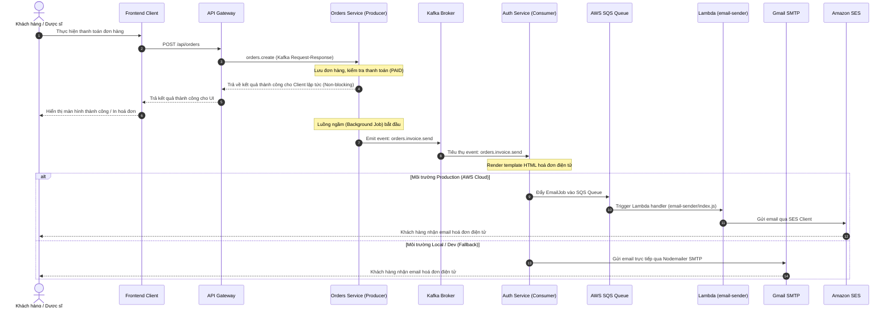

* [ ] 

# R&D: UC-12 — Asynchronous Electronic Invoice Email Architecture

---

## 🔍 Phân tích vấn đề hiện tại (Problem Analysis)

### ❌ Điểm yếu của việc gửi Email đồng bộ truyền thống (Synchronous Email Blocking)

| Vấn đề                         | Mô tả                                                                                                                                                                                        | Mức độ nguy hiểm                                   |
| :-------------------------------- | :--------------------------------------------------------------------------------------------------------------------------------------------------------------------------------------------- | :----------------------------------------------------- |
| **Synchronous Blocking**    | Request của client (hoặc dược sĩ tại quầy) bị treo lại để chờ kết nối và gửi mail xong. Thời gian phản hồi của SMTP có thể mất từ 1.5s - 5s.                           | 🔴 Cao (Ảnh hưởng trực tiếp đến UX thanh toán) |
| **Single Point of Failure** | Nếu server SMTP (Gmail/SES) bị rate limit hoặc mất kết nối, luồng lưu đơn hàng/thanh toán có thể bị rollback hoặc crash theo.                                                  | 🔴 Cao (Gây lỗi thanh toán)                         |
| **No Retry Mechanism**      | Khi gửi mail lỗi do sự cố mạng, email của khách hàng bị mất hoàn toàn, không có cơ chế lưu vết để tự động gửi lại (Retry).                                            | 🟠 Trung bình                                         |
| **Khó mở rộng (Scale)**  | Khi lượng giao dịch đồng thời tại hệ thống cửa hàng tăng cao, việc tạo nhiều kết nối SMTP đồng thời sẽ làm cạn kiệt tài nguyên hệ thống (Thread pool/Socket pool). | 🟠 Trung bình                                         |

---

## 🏗️ Kiến trúc mục tiêu (Target Architecture)

```Shell
Giao diện (Frontend Checkout / Retail View)
          │
          │  POST /api/orders  (patientName, patientEmail, items...)
          ▼
    [API Gateway]  ──(orders.create)──► [Orders-Service] (Backend)
                                                │
                                                │ 1. Lưu DB + Check Payment
                                                │ 2. Emit orders.invoice.send
                                                ▼
                                         [Kafka Broker] (Event Hub)
                                                │
                                                │ (Asynchronous Consumption)
                                                ▼
                                         [Auth-Service] (Consumer)
                                                │
                 ┌──────────────────────────────┴──────────────────────────────┐
                 │ Phân tách Môi trường Gửi Email (SqsEmailService)            │
                 │                                                             │
                 ▼ (Production)                                                ▼ (Local Dev / Fallback)
         [AWS SQS Queue]                                               [Gmail SMTP Transporter]
                 │                                                             │
                 ▼                                                             ▼
         [AWS Lambda (email-sender)]                                    [Hòm thư Khách hàng]
                 │
                 ▼
         [Amazon SES (SES Client)]
                 │
                 ▼
         [Hòm thư Khách hàng]
```

🔄 Luồng tương tác chi tiết (Sequence Interaction)



---

## 🗺️ Đặc tả triển khai kỹ thuật (Technical Specs)

### Tầng 1: Cấu trúc Dữ liệu Đơn hàng (Schema)

Trường `patientEmail` được khai báo trong `OrderSchema` của `orders-service` dưới dạng tùy chọn để hỗ trợ khách lẻ tại quầy không muốn cung cấp email:

```typescript
@Prop({ type: String })
patientEmail?: string;
```

### Tầng 2: Asynchronous Kafka Event Producer

Khi thanh toán trực tiếp (CASH/CARD) hoặc nhận webhook xác thực từ cổng thanh toán trực tuyến (PayOS) trạng thái `PAID`, `orders-service` gọi hàm fire-and-forget:

```typescript
private sendInvoiceEmailAsync(order: any) {
  if (order.patientEmail) {
    this.authClient.emit('orders.invoice.send', {
      orderCode: order.orderCode,
      patientEmail: order.patientEmail,
      patientName: order.patientName,
      items: order.items,
      totalAmount: order.totalAmount,
      paymentMethod: order.paymentMethod,
      createdAt: order.createdAt
    });
  }
}
```

### Tầng 3: SQS/SMTP Dual-Mode Email Client

Trong `auth-service`, `SqsEmailService` tự động chuyển đổi phương thức hoạt động dựa vào biến môi trường:

- **SES Mode (Production):** Nếu tồn tại `SQS_EMAIL_QUEUE_URL`, gửi message JSON vào AWS SQS.
- **SMTP Mode (Local Fallback):** Nếu không cấu hình hàng đợi SQS nhưng có `SMTP_USER` & `SMTP_PASS`, dùng `nodemailer` để tạo kết nối TLS gửi thư.

---

## 🧪 Kịch Bản Kiểm Thử Chi Tiết (Verification Test Cases)

### TC-01: Luồng tự động cho Khách đặt Online (Đồng bộ Profile)

1. **Các bước:** Đăng nhập tài khoản khách hàng -> Giỏ hàng -> Thanh toán -> Nhập thông tin -> Hoàn thành thanh toán.
2. **Kỳ vọng:** Email của tài khoản (`loyaltyInfo.email`) tự động đính kèm vào đơn hàng -> Bắn event Kafka -> Gửi mail thành công tới hòm thư người dùng.

### TC-02: Dược sĩ tại quầy nhập Email thủ công

1. **Các bước:** Bán lẻ tại quầy -> Thêm thuốc -> Nhập email thủ công tại ô "Email nhận hóa đơn" -> Chọn Cash/Card -> Thanh toán đơn hàng.
2. **Kỳ vọng:** Email nhập thủ công được ghi nhận vào DB đơn hàng -> Bắn event bất đồng bộ -> Gửi mail thành công tới email khách hàng cung cấp.

### TC-03: Khách hàng không cung cấp Email (Không lỗi hệ thống)

1. **Các bước:** Bán lẻ tại quầy -> Không nhập thông tin Email -> Nhấn thanh toán hoàn thành đơn.
2. **Kỳ vọng:** Đơn hàng được tạo thành công -> Log cảnh báo: `No patientEmail configured for orderCode: [CODE] — skipping invoice email` -> Không phát sinh exception gây crash API.

### TC-04: Đơn hàng PayOS Online (Chờ thanh toán thành công)

1. **Các bước:** Checkout online -> Chọn QR_PAY -> Trang hiển thị QR của PayOS -> Chưa thanh toán (Event chưa bắn) -> Thực hiện quét mã giả lập thành công -> Trạng thái đổi thành `PAID`.
2. **Kỳ vọng:** Chỉ khi webhook/polling xác nhận đơn là `PAID`, email mới được kích hoạt gửi bất đồng bộ.

### TC-05: Đo lường tính bất đồng bộ (Non-blocking Verification)

1. **Các bước:** Thực hiện thanh toán đơn hàng trực tiếp bằng CASH/CARD.
2. **Kỳ vọng:** API Gateway trả về response `success: true` gần như ngay lập tức (dưới 100ms) -> Log container ghi nhận: `[Auth MS] Nhận sự kiện gửi hóa đơn điện tử...` và hoàn tất gửi mail chạy ngầm phía sau mà không chặn tiến trình phản hồi của UI.
