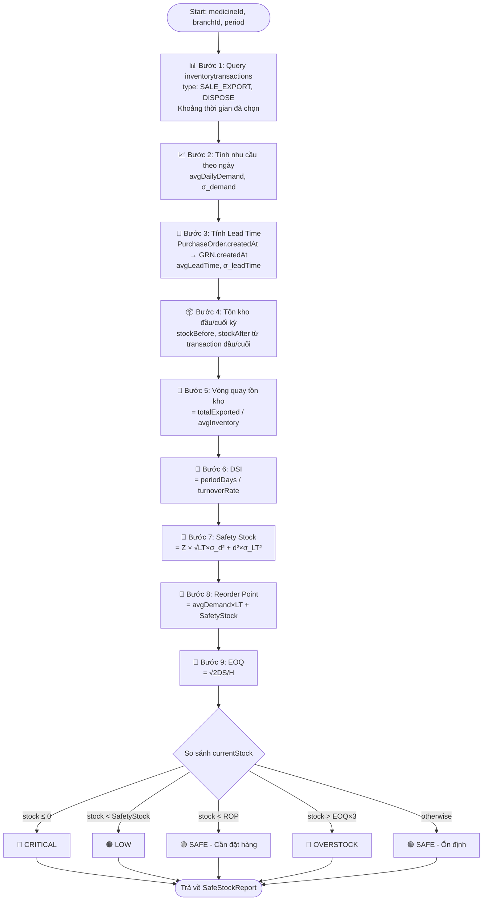

# 🔄 Giải Thuật Tính Vòng Quay Tồn Kho An Toàn (Safe Stock Turnover)

> Dựa trên database MongoDB thực tế của hệ thống Pharmacy WDP301

---

## 📦 Database Collections liên quan

| Collection | Mục đích |
|---|---|
| `medicines` | Danh mục thuốc, `stock` hiện tại |
| `medicinebatches` | Lô hàng theo chi nhánh, `stock` theo lô |
| `inventorytransactions` | Nhật ký biến động kho (`quantityChange`, `type`) |
| `goodsreceiptnotes` | Phiếu nhập hàng từ NCC |
| `orders` | Đơn hàng bán ra (`PAID`) |
| `purchaserequisitions` | Phiếu đặt hàng nội bộ |

---

## 📐 Các Công Thức Cốt Lõi

### 1. Vòng Quay Tồn Kho (Inventory Turnover Rate)

```
Vòng quay tồn kho = Tổng số lượng xuất trong kỳ / Tồn kho trung bình
```

**Cách tính từ DB:**
- **Tổng xuất trong kỳ** = Tổng `|quantityChange|` từ `inventorytransactions` nơi `type IN ['SALE_EXPORT', 'DISPOSE']` trong khoảng thời gian `[startDate, endDate]`
- **Tồn kho trung bình** = (`stockBefore_đầu_kỳ` + `stockAfter_cuối_kỳ`) / 2

---

### 2. Số Ngày Tồn Kho (Days In Inventory / DSI)

```
DSI = Số ngày trong kỳ / Vòng quay tồn kho
```

Ví dụ: Kỳ 30 ngày, vòng quay = 3 → DSI = 10 ngày

---

### 3. Tồn Kho An Toàn (Safety Stock)

```
Safety Stock = Z × σ_d × √(Lead Time)
```

| Tham số | Ý nghĩa | Lấy từ DB |
|---|---|---|
| `Z` | Hệ số mức phục vụ (service level) | Cấu hình: 1.65 = 95%, 2.05 = 98% |
| `σ_d` | Độ lệch chuẩn nhu cầu theo ngày | Tính từ `inventorytransactions` |
| `Lead Time` | Thời gian nhập hàng (ngày) | Tính từ `purchaseorders.createdAt` → `goodsreceiptnotes.createdAt` |

---

### 4. Điểm Đặt Hàng Lại (Reorder Point - ROP)

```
ROP = (Nhu cầu trung bình/ngày × Lead Time) + Safety Stock
```

---

### 5. Số Lượng Đặt Hàng Tối Ưu (EOQ - Economic Order Quantity)

```
EOQ = √(2 × D × S / H)
```

| Tham số | Ý nghĩa |
|---|---|
| `D` | Nhu cầu hàng năm (units/year) |
| `S` | Chi phí mỗi lần đặt hàng (đồng) |
| `H` | Chi phí lưu kho/unit/năm (đồng) |

---

## 🧮 Giải Thuật Chi Tiết (Pseudo-code)

```typescript
/**
 * GIẢI THUẬT TÍNH VÒNG QUAY TỒN KHO AN TOÀN
 * Input: medicineId, branchId, startDate, endDate, leadTimeDays, serviceLevel
 * Output: SafeStockReport
 */

async function calculateSafeStockTurnover(
  medicineId: string,
  branchId: string,
  startDate: Date,
  endDate: Date,
  serviceLevel: number = 0.95   // mặc định 95%
): Promise<SafeStockReport> {
  
  const periodDays = (endDate - startDate) / (1000 * 60 * 60 * 24);

  // ═══════════════════════════════════════════
  // BƯỚC 1: LẤY DỮ LIỆU BIẾN ĐỘNG XUẤT KHO
  // Collection: inventorytransactions
  // ═══════════════════════════════════════════
  const exportTxns = await InventoryTransaction.find({
    medicineId,
    type: { $in: ['SALE_EXPORT', 'DISPOSE'] },
    createdAt: { $gte: startDate, $lte: endDate }
  }).sort({ createdAt: 1 });

  // Tổng số lượng xuất
  const totalExported = exportTxns.reduce(
    (sum, t) => sum + Math.abs(t.quantityChange), 0
  );

  // Nhu cầu trung bình mỗi ngày
  const avgDailyDemand = totalExported / periodDays;

  // ═══════════════════════════════════════════
  // BƯỚC 2: TÍNH ĐỘ LỆCH CHUẨN NHU CẦU
  // Group theo ngày → tính σ
  // ═══════════════════════════════════════════
  const demandByDay = groupByDay(exportTxns);
  // demandByDay = { "2026-06-01": 5, "2026-06-02": 8, "2026-06-03": 0, ... }

  // Điền 0 cho ngày không có giao dịch
  const allDays = generateDateRange(startDate, endDate);
  const dailyDemandArray = allDays.map(d => demandByDay[d] ?? 0);

  const stdDev = calculateStdDev(dailyDemandArray, avgDailyDemand);
  // stdDev = σ_d (độ lệch chuẩn nhu cầu theo ngày)

  // ═══════════════════════════════════════════
  // BƯỚC 3: TÍNH THỜI GIAN GIAO HÀNG (LEAD TIME)
  // Collection: purchaseorders → goodsreceiptnotes
  // ═══════════════════════════════════════════
  const completedPOs = await PurchaseOrder.find({
    status: 'COMPLETED',
    'items.medicineId': medicineId,
    createdAt: { $gte: startDate, $lte: endDate }
  });

  const grns = await GoodsReceiptNote.find({
    poId: { $in: completedPOs.map(p => p._id.toString()) },
    status: 'COMPLETED'
  });

  // Lead time = thời gian từ tạo PO đến nhận GRN
  const leadTimes = completedPOs.map(po => {
    const grn = grns.find(g => g.poId === po._id.toString());
    if (!grn) return null;
    return (grn.createdAt - po.createdAt) / (1000 * 60 * 60 * 24); // ngày
  }).filter(Boolean);

  const avgLeadTime = leadTimes.length > 0
    ? leadTimes.reduce((a, b) => a + b, 0) / leadTimes.length
    : 7; // fallback: 7 ngày nếu chưa có lịch sử

  const stdDevLeadTime = calculateStdDev(leadTimes, avgLeadTime);

  // ═══════════════════════════════════════════
  // BƯỚC 4: TÍNH TỒN KHO ĐẦU & CUỐI KỲ
  // Collection: inventorytransactions
  // ═══════════════════════════════════════════
  const firstTxn = exportTxns[0]; // giao dịch đầu kỳ
  const lastTxn = exportTxns[exportTxns.length - 1]; // giao dịch cuối kỳ

  const openingStock = firstTxn?.stockBefore ?? currentMedicineStock;
  const closingStock = lastTxn?.stockAfter ?? currentMedicineStock;
  const avgInventory = (openingStock + closingStock) / 2;

  // ═══════════════════════════════════════════
  // BƯỚC 5: TÍNH VÒNG QUAY TỒN KHO
  // ═══════════════════════════════════════════
  const inventoryTurnoverRate = avgInventory > 0
    ? totalExported / avgInventory
    : 0;

  // Số ngày tồn kho (DSI)
  const daysInInventory = inventoryTurnoverRate > 0
    ? periodDays / inventoryTurnoverRate
    : periodDays;

  // ═══════════════════════════════════════════
  // BƯỚC 6: TÍNH HỆ SỐ Z theo Service Level
  // ═══════════════════════════════════════════
  const Z_TABLE = {
    0.90: 1.28,
    0.95: 1.65,   // phổ biến nhất cho dược phẩm
    0.98: 2.05,
    0.99: 2.33,
  };
  const Z = Z_TABLE[serviceLevel] ?? 1.65;

  // ═══════════════════════════════════════════
  // BƯỚC 7: TÍNH TỒN KHO AN TOÀN (SAFETY STOCK)
  // Công thức đầy đủ xét cả biến động Lead Time:
  // SS = Z × √(LT × σ_d² + d² × σ_LT²)
  // ═══════════════════════════════════════════
  const safetyStock = Z * Math.sqrt(
    avgLeadTime * Math.pow(stdDev, 2) +
    Math.pow(avgDailyDemand, 2) * Math.pow(stdDevLeadTime, 2)
  );

  // ═══════════════════════════════════════════
  // BƯỚC 8: TÍNH ĐIỂM ĐẶT HÀNG LẠI (ROP)
  // ═══════════════════════════════════════════
  const reorderPoint = (avgDailyDemand * avgLeadTime) + safetyStock;

  // ═══════════════════════════════════════════
  // BƯỚC 9: TÍNH EOQ (Economic Order Quantity)
  // Giả định: S = 200,000đ/lần đặt, H = 5% giá nhập/unit/năm
  // ═══════════════════════════════════════════
  const annualDemand = avgDailyDemand * 365;
  const orderingCost = 200000; // VND/lần đặt
  const holdingCostRate = 0.05; // 5% giá nhập
  const unitCost = medicine.price ?? 10000;
  const holdingCost = holdingCostRate * unitCost;

  const eoq = Math.sqrt(
    (2 * annualDemand * orderingCost) / holdingCost
  );

  // ═══════════════════════════════════════════
  // BƯỚC 10: ĐÁNH GIÁ TRẠNG THÁI TỒN KHO
  // So sánh tồn kho hiện tại với các ngưỡng
  // ═══════════════════════════════════════════
  const currentStock = medicine.stock; // từ medicines collection

  let stockStatus: 'CRITICAL' | 'LOW' | 'SAFE' | 'OVERSTOCK';
  if (currentStock <= 0) {
    stockStatus = 'CRITICAL';              // Hết hàng
  } else if (currentStock < safetyStock) {
    stockStatus = 'LOW';                   // Dưới mức an toàn
  } else if (currentStock < reorderPoint) {
    stockStatus = 'SAFE';                  // Cần đặt hàng sớm
  } else if (currentStock > eoq * 3) {
    stockStatus = 'OVERSTOCK';            // Tồn kho quá cao
  } else {
    stockStatus = 'SAFE';                  // Ổn định
  }

  // ═══════════════════════════════════════════
  // KẾT QUẢ TRẢ VỀ
  // ═══════════════════════════════════════════
  return {
    medicineId,
    medicineName: medicine.name,
    branchId,
    period: { startDate, endDate, days: periodDays },

    // Nhu cầu
    demand: {
      totalExported,
      avgDailyDemand: round2(avgDailyDemand),
      stdDevDemand: round2(stdDev),
    },

    // Lead time
    leadTime: {
      avgDays: round2(avgLeadTime),
      stdDevDays: round2(stdDevLeadTime),
      sampleCount: leadTimes.length,
    },

    // Vòng quay
    turnover: {
      openingStock,
      closingStock,
      avgInventory: round2(avgInventory),
      inventoryTurnoverRate: round2(inventoryTurnoverRate), // lần/kỳ
      daysInInventory: round2(daysInInventory),             // ngày/lần
    },

    // Ngưỡng tồn kho
    thresholds: {
      safetyStock: Math.ceil(safetyStock),
      reorderPoint: Math.ceil(reorderPoint),
      eoq: Math.ceil(eoq),
      serviceLevel: serviceLevel * 100 + '%',
    },

    // Trạng thái
    currentStock,
    stockStatus,
    recommendation: generateRecommendation(
      stockStatus, currentStock, reorderPoint, safetyStock, eoq
    ),
  };
}
```

---

## 🌊 Sơ Đồ Luồng Giải Thuật



---

## 🗄️ MongoDB Aggregation Pipeline Thực Tế

```javascript
// Tính nhu cầu theo ngày trong kỳ (cho 1 thuốc, 1 chi nhánh)
db.inventorytransactions.aggregate([
  {
    $match: {
      medicineId: "MEDICINE_ID",
      type: { $in: ["SALE_EXPORT", "DISPOSE"] },
      createdAt: { $gte: ISODate("2026-06-01"), $lte: ISODate("2026-06-30") }
    }
  },
  {
    $group: {
      _id: { $dateToString: { format: "%Y-%m-%d", date: "$createdAt" } },
      dailyDemand: { $sum: { $abs: "$quantityChange" } }
    }
  },
  {
    $group: {
      _id: null,
      totalExported:  { $sum: "$dailyDemand" },
      avgDailyDemand: { $avg: "$dailyDemand" },
      daysWithSales:  { $count: {} },
      // Tính variance để lấy stdDev
      variance: {
        $avg: { $pow: [{ $subtract: ["$dailyDemand", { $avg: "$dailyDemand" }] }, 2] }
      }
    }
  },
  {
    $addFields: {
      stdDevDemand: { $sqrt: "$variance" }
    }
  }
])
```

```javascript
// Tính Lead Time trung bình từ PO → GRN
db.purchaseorders.aggregate([
  {
    $match: {
      status: "COMPLETED",
      "items.medicineId": "MEDICINE_ID"
    }
  },
  {
    $lookup: {
      from: "goodsreceiptnotes",
      localField: "_id",
      foreignField: "poId",
      as: "grn"
    }
  },
  { $unwind: "$grn" },
  {
    $addFields: {
      leadTimeDays: {
        $divide: [
          { $subtract: ["$grn.createdAt", "$createdAt"] },
          86400000  // ms per day
        ]
      }
    }
  },
  {
    $group: {
      _id: null,
      avgLeadTime: { $avg: "$leadTimeDays" },
      stdDevLeadTime: { $stdDevPop: "$leadTimeDays" },
      count: { $sum: 1 }
    }
  }
])
```

---

## 📊 Ví Dụ Tính Thực Tế

**Thuốc:** Paracetamol 500mg | **Chi nhánh:** BR-001 | **Kỳ:** 30 ngày (Tháng 6/2026)

| Tham số | Giá trị |
|---|---|
| Tổng xuất kỳ | 450 viên |
| Nhu cầu TB/ngày (`d̄`) | 15 viên/ngày |
| Độ lệch chuẩn nhu cầu (`σ_d`) | 4.2 viên |
| Lead Time TB (`L̄`) | 5 ngày |
| Độ lệch chuẩn Lead Time (`σ_L`) | 1.5 ngày |
| Tồn đầu kỳ | 200 viên |
| Tồn cuối kỳ | 80 viên |
| Tồn TB | 140 viên |
| **Vòng quay** | **450 / 140 = 3.21 lần/tháng** |
| **DSI** | **30 / 3.21 = 9.35 ngày** |

**Tính Safety Stock (service level 95%, Z = 1.65):**
```
SS = 1.65 × √(5 × 4.2² + 15² × 1.5²)
   = 1.65 × √(5 × 17.64 + 225 × 2.25)
   = 1.65 × √(88.2 + 506.25)
   = 1.65 × √594.45
   = 1.65 × 24.38
   ≈ 40 viên
```

**Reorder Point:**
```
ROP = 15 × 5 + 40 = 75 + 40 = 115 viên
```

> **→ Tồn hiện tại 80 viên < ROP 115 viên** ⚠️ Cần đặt hàng ngay!

---

## 💡 Khuyến Nghị Kết Quả (generateRecommendation)

| Trạng thái | Màu | Hành động |
|---|---|---|
| `CRITICAL` | 🔴 | Đặt hàng khẩn cấp, tạo PR với `isUrgent = true` |
| `LOW` | 🟠 | Tạo PR ngay, cần duyệt sớm |
| `SAFE` (dưới ROP) | 🟡 | Chuẩn bị tạo PR trong 1-2 ngày |
| `SAFE` (ổn định) | 🟢 | Không cần hành động |
| `OVERSTOCK` | 🔵 | Giảm đặt hàng, ưu tiên bán hàng |

---

## 📁 Vị Trí Implement Đề Xuất

```
backend/apps/inventory-service/src/
├── medicine/
│   ├── medicine.service.ts          ← Thêm calculateSafeStockTurnover()
│   └── dto/
│       └── safe-stock-report.dto.ts ← [NEW] DTO kết quả
└── reports/
    ├── reports.service.ts           ← Tích hợp lưu báo cáo vào Report collection
    └── schemas/
        └── report.schema.ts         ← Đã có
```

**API Endpoint đề xuất (trong api-gateway):**
```
GET /inventory/safe-stock?medicineId=X&branchId=Y&startDate=Z&endDate=W&serviceLevel=0.95
GET /inventory/safe-stock/all-branches?medicineId=X  ← tổng hợp tất cả chi nhánh
POST /inventory/safe-stock/bulk                      ← tính hàng loạt cho tất cả thuốc
```
