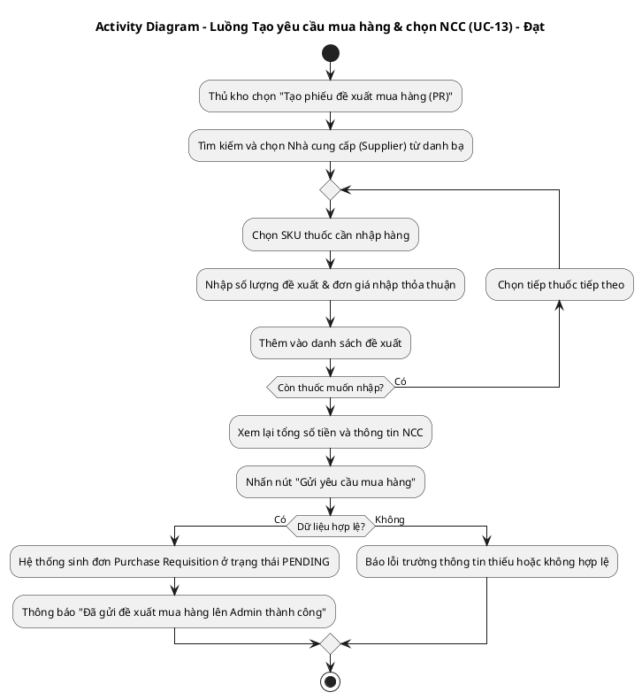
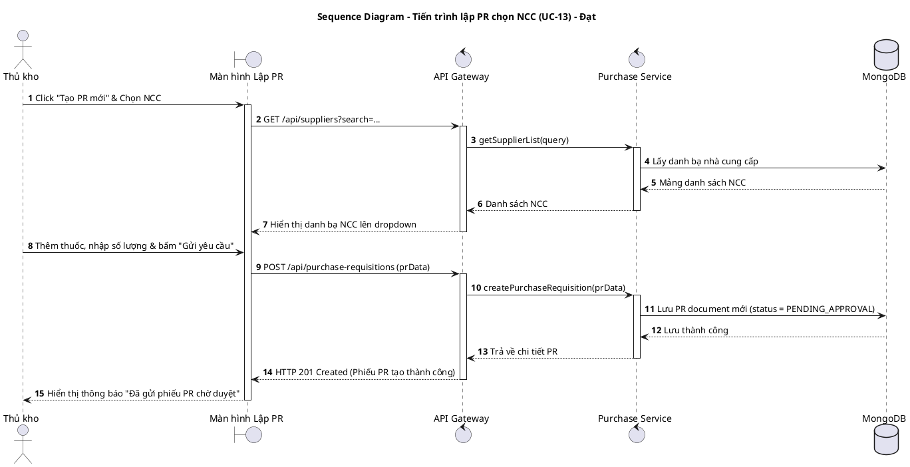
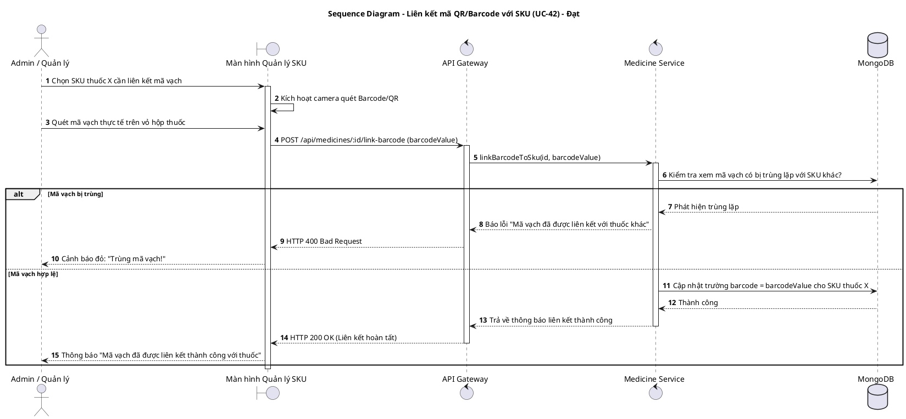
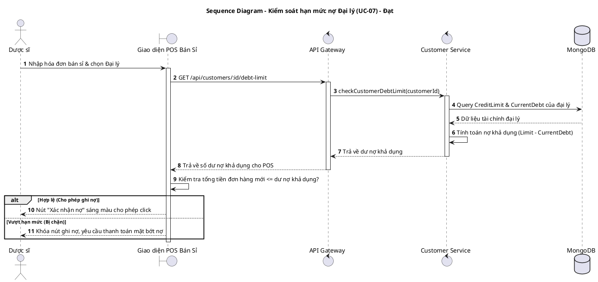
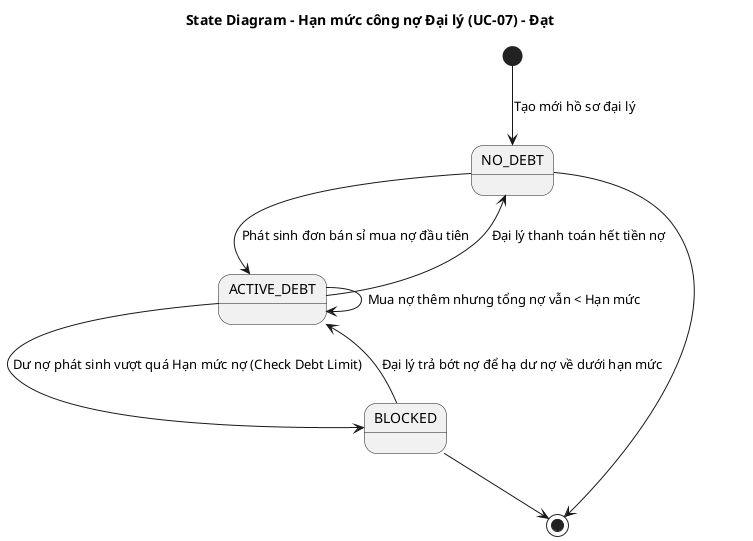
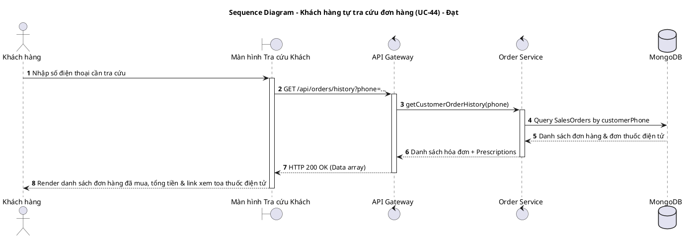
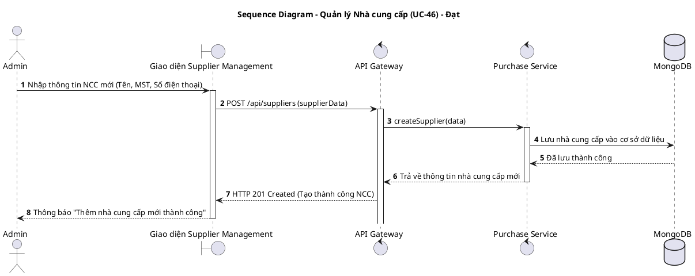
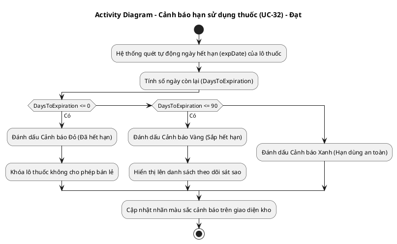
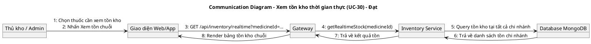

# TÀI LIỆU UML - THÀNH VIÊN: ĐẠT (DEVELOPER)
**Danh sách UCs đã hoàn thành: UC-07, UC-13, UC-30, UC-32, UC-42, UC-43, UC-44, UC-46**

Tài liệu này chứa các luồng nghiệp vụ chi tiết và mã nguồn **PlantUML** cho toàn bộ các UCs đã hoàn thành do Đạt chịu trách nhiệm thiết kế.

---

## 1. UC-13: TẠO PHIẾU NHẬP HÀNG & CHỌN NHÀ CUNG CẤP

### A. Luồng nghiệp vụ
1. Thủ kho/Quản lý chi nhánh lập đề xuất nhập hàng (Purchase Requisition).
2. Lựa chọn nhà cung cấp trong danh bạ liên kết.
3. Nhập số lượng thuốc cần mua, đơn giá thỏa thuận.
4. Gửi yêu cầu mua PO lên hệ thống ở trạng thái chờ duyệt.

### B. Activity Diagram (PlantUML)

### C. Sequence Diagram (PlantUML)

---

## 2. UC-42: LIÊN KẾT MÃ QR / BARCODE VỚI SKU THUỐC

### A. Luồng nghiệp vụ
1. Admin chọn một thuốc chưa được cấu hình mã vạch.
2. Dùng máy quét hoặc camera quét mã Barcode/QR có sẵn trên vỏ hộp thuốc của nhà sản xuất.
3. Lưu mã quét được và liên kết trực tiếp với mã SKU nội bộ của hệ thống để đồng bộ quét đếm POS / Kiểm kho.

### B. Sequence Diagram (PlantUML)

---

## 3. UC-07: QUẢN LÝ HẠN MỨC CÔNG NỢ CỦA ĐẠI LÝ (DEBT LIMIT)

### A. Luồng nghiệp vụ
1. Khi có đơn bán sỉ mua nợ, hệ thống kiểm tra số tiền nợ hiện tại cộng với tiền đơn mới.
2. Nếu vượt quá hạn mức nợ khả dụng, chặn thanh toán ghi nợ.
3. Nếu hợp lệ, tăng nợ đại lý và cho phép xuất kho.

### B. Sequence Diagram (PlantUML)

### C. State Diagram (Vòng đời hạn mức nợ - UC-07)

---

## 4. UC-43 & UC-44: HỒ SƠ KHÁCH HÀNG & KHÁCH TỰ TRA CỨU ĐƠN HÀNG

### A. Luồng nghiệp vụ
1. Quản lý cập nhật thông tin khách hàng thân thiết (`UC-43`).
2. Khách hàng tự nhập số điện thoại để tra cứu các đơn hàng và toa thuốc điện tử của mình (`UC-44`).

### B. Sequence Diagram (PlantUML)

---

## 5. UC-46: QUẢN LÝ NHÀ CUNG CẤP (CRUD & ĐÁNH GIÁ SUPPILER)

### A. Luồng nghiệp vụ
1. Admin thực hiện thêm, sửa, xóa thông tin nhà cung cấp và đánh giá chất lượng cung cấp hàng.

### B. Sequence Diagram (PlantUML)

---

## 6. UC-32: CẢNH BÁO HẠN SỬ DỤNG LÔ THUỐC (ĐỎ / VÀNG / XANH)

### A. Luồng nghiệp vụ
1. Hệ thống tự động quét hạn sử dụng của tất cả các lô thuốc đang lưu kho và cảnh báo theo màu sắc.

### B. Activity Diagram (PlantUML)

---

## 7. UC-30: XEM TỒN KHO THỜI GIAN THỰC TOÀN CHUỖI

### A. Luồng nghiệp vụ
1. Quản lý / Thủ kho tra cứu lượng tồn kho của một SKU thuốc trên toàn bộ các chi nhánh chuỗi nhà thuốc.

### B. Communication Diagram (PlantUML)

---

## 💻 HƯỚNG DẪN XUẤT ẢNH BẰNG PLANTTEXT
1. Truy cập [https://www.planttext.com](https://www.planttext.com)
2. Copy đoạn mã từ `@startuml` đến `@enduml` dán vào khung bên trái.
3. Bấm **Generate** để kết xuất ảnh PNG chất lượng cao.
