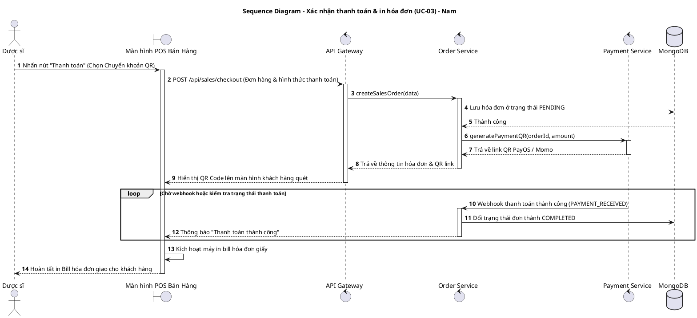
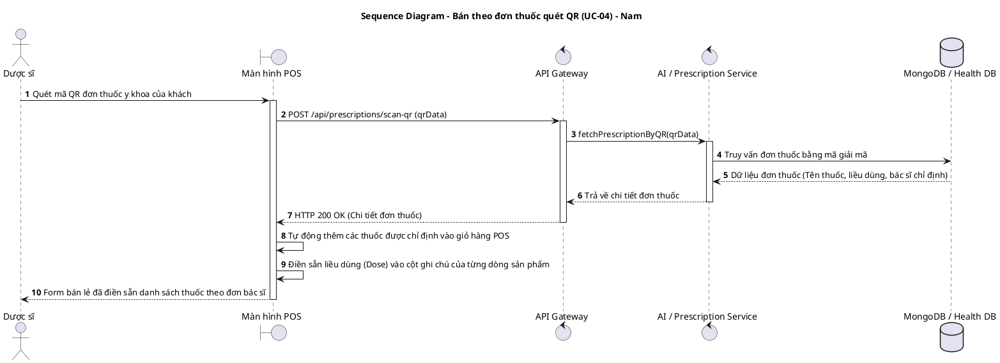
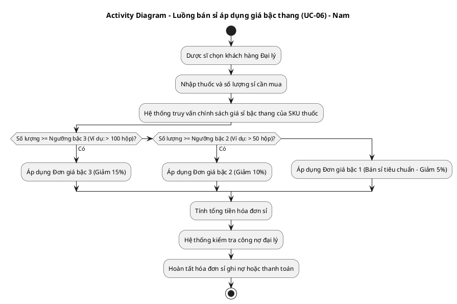
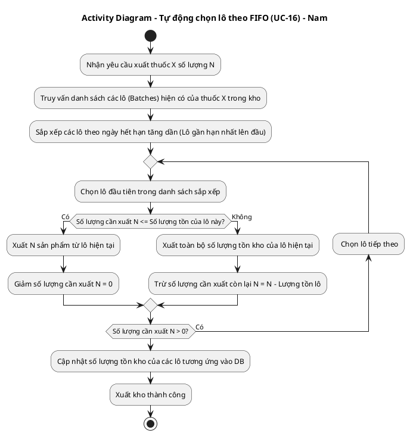
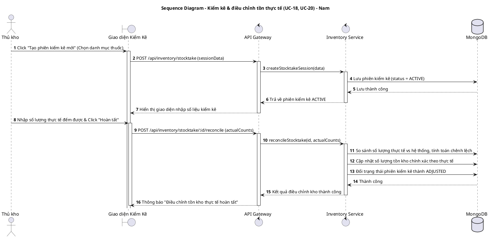
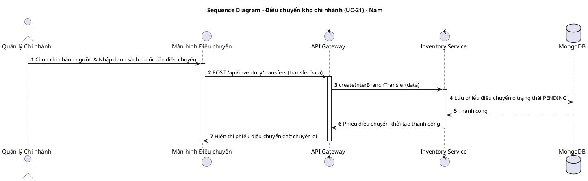
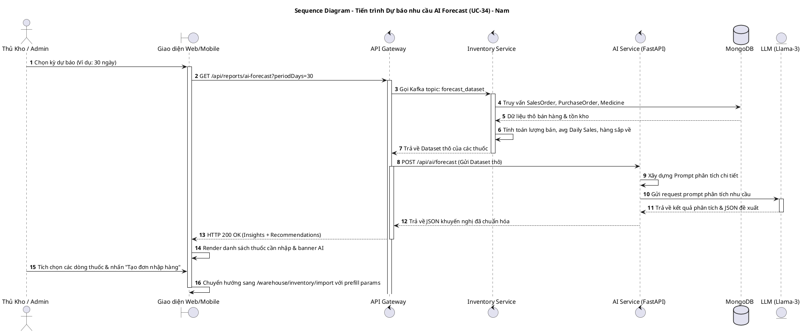
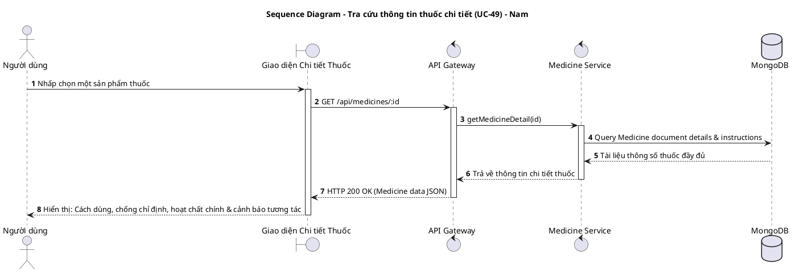

# TÀI LIỆU UML - THÀNH VIÊN: NAM (DEVELOPER / AI)
**Danh sách UCs đã hoàn thành: UC-03, UC-04, UC-06, UC-08, UC-09, UC-16, UC-18, UC-21, UC-23, UC-34, UC-49**

Tài liệu này chứa các luồng nghiệp vụ chi tiết và mã nguồn **PlantUML** cho toàn bộ các UCs đã hoàn thành do Nam chịu trách nhiệm thiết kế.

---

## 1. UC-03: XÁC NHẬN THANH TOÁN & IN HÓA ĐƠN

### A. Luồng nghiệp vụ
1. Dược sĩ nhấn nút "Thanh toán" tại màn hình POS.
2. Chọn phương thức thanh toán: Tiền mặt hoặc Chuyển khoản qua cổng QR (ví dụ: PayOS).
3. Hệ thống tạo hóa đơn, kiểm tra trạng thái thanh toán và in hóa đơn (Bill).

### B. Sequence Diagram (PlantUML)


---

## 2. UC-04: BÁN THEO ĐƠN THUỐC – QUÉT MÃ QR ĐIỆN TỬ

### A. Luồng nghiệp vụ
1. Khách hàng mang đơn thuốc điện tử có chứa mã QR Code từ phòng khám đến nhà thuốc.
2. Dược sĩ quét mã QR đơn thuốc bằng camera thiết bị.
3. Hệ thống giải mã QR để lấy ID đơn thuốc y khoa điện tử, tự động truy vấn thông tin đơn từ cơ sở dữ liệu y tế và đổ các thuốc chỉ định vào giỏ hàng POS kèm theo liều lượng được điền sẵn.

### B. Sequence Diagram (PlantUML)


---

## 3. UC-06: BÁN SỈ – LẬP HÓA ĐƠN & BẢNG GIÁ BẬC THANG

### A. Luồng nghiệp vụ
1. Dược sĩ chọn khách hàng là Đại lý / Nhà thuốc liên kết.
2. Chọn thuốc và nhập số lượng lớn để mua sỉ.
3. Hệ thống tự động áp dụng bảng giá bậc thang (Mua càng nhiều chiết khấu càng cao) theo chính sách giá sỉ của doanh nghiệp.
4. Xuất hóa đơn bán sỉ và ghi nhận công nợ đại lý.

### B. Activity Diagram (PlantUML)


---

## 4. UC-08 & UC-09: XỬ LÝ ĐỔI / TRẢ HÀNG VÀ CẬP NHẬT LẠI TỒN KHO

### A. Luồng nghiệp vụ
1. Khách hàng mang thuốc bị lỗi đến đổi trả. Dược sĩ nhập mã hóa đơn gốc.
2. Chọn sản phẩm đổi trả, nhập lý do.
3. Hệ thống hoàn tiền cho khách, đồng thời cập nhật tăng tồn kho tại chi nhánh đó.

### B. Activity Diagram (PlantUML)
```plantuml
@startuml
title Activity Diagram - Quy trình đổi trả hàng & hoàn tiền (UC-08, UC-09) - Nam
start
:Nhập mã hóa đơn gốc cần đổi trả;
:Hệ thống hiển thị danh sách thuốc đã mua;
:Dược sĩ chọn thuốc khách muốn trả lại;
:Nhập số lượng trả & lý do đổi trả;
:Xác nhận hoàn tiền;
fork
  :Ghi nhận giao dịch hoàn tiền (Refund Transaction);
fork separator
  :Hệ thống tự động cộng lại số lượng thuốc vào tồn kho chi nhánh;
  :Ghi nhận giao dịch kho loại INBOUND_REFUND;
end fork
:In phiếu đổi trả hàng và đưa tiền hoàn cho khách;
stop
@enduml
```

---

## 5. UC-16: XUẤT KHO THEO NGUYÊN TẮC FIFO & CẢNH BÁO GẦN HẠN SỬ DỤNG

### A. Luồng nghiệp vụ
1. Khi có yêu cầu xuất kho (bán hàng hoặc chuyển kho), hệ thống tự động chọn xuất các lô thuốc có ngày nhập trước hoặc ngày hết hạn gần nhất (First In, First Out).

### B. Activity Diagram (PlantUML)


---

## 6. UC-18 & UC-20: TẠO PHIÊN KIỂM KÊ KHO VÀ ĐIỀU CHỈNH TỒN KHO THỰC TẾ

### A. Luồng nghiệp vụ
1. Thủ kho tạo phiên kiểm kê theo khu vực (`UC-18`).
2. Tiến hành đếm thực tế, đối chiếu chênh lệch và cập nhật số lượng điều chỉnh kho (`UC-20`).

### B. Sequence Diagram (PlantUML)


---

## 7. UC-21: TẠO PHIẾU ĐIỀU CHUYỂN GIỮA CÁC CHI NHÁNH

### A. Luồng nghiệp vụ
1. Quản lý chi nhánh gửi yêu cầu chuyển hàng từ chi nhánh khác sang chi nhánh mình khi hết hàng.

### B. Sequence Diagram (PlantUML)


---

## 8. UC-34: DỰ BÁO NHU CẦU NHẬP HÀNG THEO KỲ (AI FORECAST)

### A. Luồng nghiệp vụ
1. Gửi request phân tích AI Forecast -> AI Service FastAPI -> LLM Llama-3 -> Đề xuất kế hoạch nhập kho.

### B. Sequence Diagram (PlantUML)


---

## 9. UC-49: TRA CỨU THÔNG TIN THUỐC (HƯỚNG DẪN, LIỀU DÙNG, TƯƠNG TÁC)

### A. Luồng nghiệp vụ
1. Người dùng (Khách/Dược sĩ) chọn xem chi tiết SKU thuốc.
2. Hệ thống tải thông số hướng dẫn sử dụng, chỉ định y khoa và các hoạt chất tương tác xung khắc.

### B. Sequence Diagram (PlantUML)


---

## 💻 HƯỚNG DẪN XUẤT ẢNH BẰNG PLANTTEXT
1. Truy cập [https://www.planttext.com](https://www.planttext.com)
2. Copy đoạn mã từ `@startuml` đến `@enduml` dán vào khung bên trái.
3. Bấm **Generate** để kết xuất ảnh PNG chất lượng cao.
