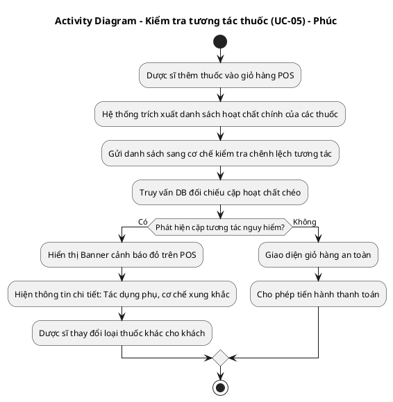
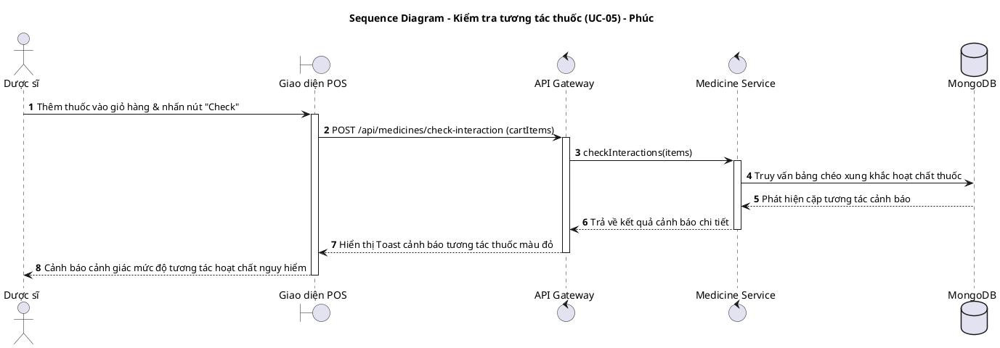
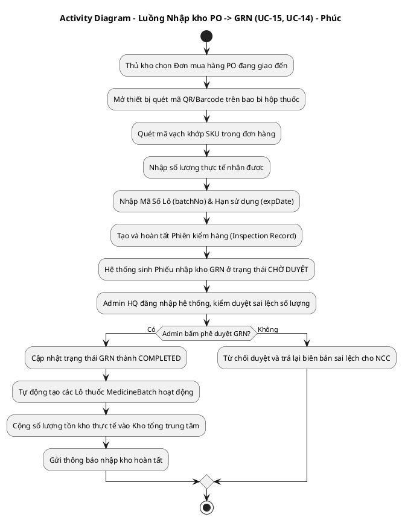
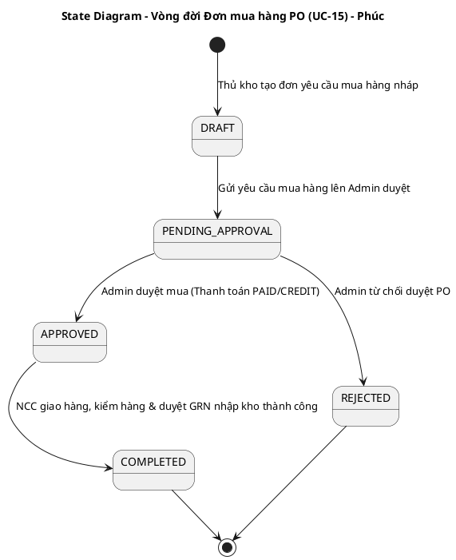
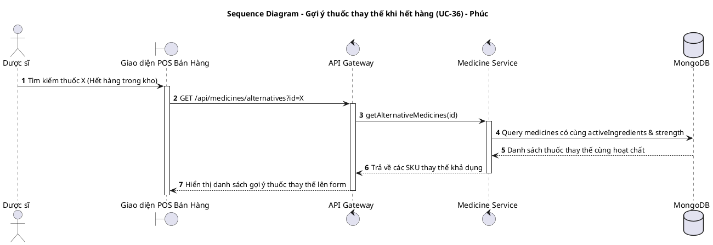
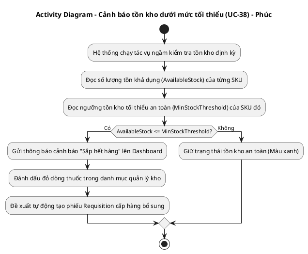
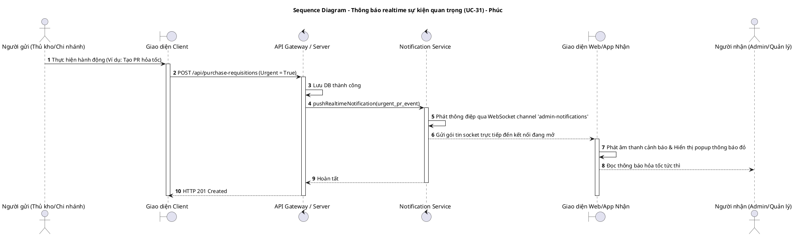

# TÀI LIỆU UML - THÀNH VIÊN: PHÚC (ADMIN / DEVELOPER)
**Danh sách UCs đã hoàn thành: UC-05, UC-14, UC-15, UC-31, UC-36, UC-38, UC-48**

Tài liệu này chứa các luồng nghiệp vụ chi tiết và mã nguồn **PlantUML** cho toàn bộ các UCs đã hoàn thành do Phúc chịu trách nhiệm thiết kế.

---

## 1. UC-05: KIỂM TRA TƯƠNG TÁC THUỐC (AI INTERACTION CHECK)

### A. Luồng nghiệp vụ
1. Dược sĩ thêm nhiều sản phẩm thuốc vào giỏ hàng tại quầy POS.
2. Hệ thống gửi danh sách hoạt chất chính của các thuốc trong giỏ hàng sang Medicine Service để kiểm tra tương tác chéo.
3. So khớp chéo danh mục hoạt chất với bảng tương tác thuốc cấm.
4. Trả về kết quả cảnh báo mức độ tương tác (Nguy hiểm / Cảnh báo nhẹ / An toàn) dưới dạng Toast thông báo màu đỏ nếu có xung khắc hoạt chất.

### B. Activity Diagram (PlantUML)

### C. Sequence Diagram (PlantUML)

---

## 2. UC-14 & UC-15: DUYỆT NHẬP KHO CHỨNG TỪ PO -> PHIẾU NHẬP KHO GRN

### A. Luồng nghiệp vụ
1. Thủ kho dùng thiết bị di động quét mã QR/Barcode trên kiện hàng nhà cung cấp giao đến (`UC-14`).
2. Hệ thống so khớp thông tin sản phẩm quét được với đơn đặt hàng PO gốc.
3. Nhập thông tin số lô, hạn sử dụng thực tế và số lượng đạt chuẩn để lập phiếu kiểm hàng (`UC-15`).
4. Admin duyệt GRN trên trang HQ Approval, hệ thống chính thức tăng tồn kho.

### B. Activity Diagram (PlantUML)

### C. State Diagram (Vòng đời PO - UC-15)

---

## 3. UC-36: GỢI Ý THUỐC THAY THẾ KHI HẾT HÀNG TRONG KHO

### A. Luồng nghiệp vụ
1. Dược sĩ tìm kiếm thuốc kê đơn cho khách tại POS nhưng thuốc đó đã hết hàng.
2. Hệ thống tự động truy vấn và gợi ý các thuốc thay thế có cùng hoạt chất và hàm lượng (`UC-36`).
3. Hiển thị danh sách gợi ý thuốc thay thế lên form.

### B. Sequence Diagram (PlantUML)

---

## 4. UC-38: CẢNH BÁO TỒN KHO DƯỚI MỨC TỐI THIỂU AN TOÀN (MIN STOCK)

### A. Luồng nghiệp vụ
1. Hệ thống tự động kiểm tra số lượng tồn kho khả dụng của từng loại thuốc tại chi nhánh.
2. Nếu số lượng tồn kho hiện tại nhỏ hơn mức tối thiểu an toàn (`minStock`) đã được cài đặt cho loại thuốc đó, hệ thống sẽ kích hoạt cảnh báo hết hàng dạng Banner/Notification.

### B. Activity Diagram (PlantUML)

---

## 5. UC-48: CẤU HÌNH BẢNG GIÁ BÁN LẺ / SỈ THEO TỪNG CHI NHÁNH

### A. Luồng nghiệp vụ
1. Admin điều chỉnh giá bán lẻ / bán sỉ riêng biệt cho từng chi nhánh tùy thuộc vào thị trường khu vực.

### B. Communication Diagram (PlantUML)

```plantuml
@startuml
title Communication Diagram - Cấu hình giá bán lẻ/sỉ theo chi nhánh (UC-48) - Phúc
object "Admin" as Owner
object "Giao diện Admin" as UI
object "Gateway" as Gateway
object "Medicine Service" as MedService
object "Database MongoDB" as DB

Owner -> UI : "1: Chọn thuốc cần chỉnh giá\n2: Nhập đơn giá bán riêng của chi nhánh X"
UI -> Gateway : "3: PATCH /api/medicines/:id/branch-price"
Gateway -> MedService : "4: updateBranchPrice(id, branchCode, price)"
MedService -> DB : "5: Ghi nhận đơn giá riêng cho chi nhánh vào bảng giá"
DB --> MedService : "6: Lưu DB thành công"
MedService --> Gateway : "7: Trả về bảng giá chi nhánh cập nhật"
Gateway --> UI : "8: Báo cấu hình giá chi nhánh hoàn tất"
@enduml
```

---

## 6. UC-31: THÔNG BÁO REALTIME SỰ KIỆN QUAN TRỌNG TOÀN CHUỖI

### A. Luồng nghiệp vụ
1. Các sự kiện lớn (ví dụ: tạo PR hỏa tốc, đơn hàng bị từ chối, thuốc bị hết hạn) được hệ thống bắn thông báo tức thời thông qua WebSocket/SSE lên tất cả các client đang online của nhân viên.

### B. Sequence Diagram (PlantUML)

---

## 💻 HƯỚNG DẪN XUẤT ẢNH BẰNG PLANTTEXT
1. Truy cập [https://www.planttext.com](https://www.planttext.com)
2. Copy đoạn mã từ `@startuml` đến `@enduml` dán vào khung bên trái.
3. Bấm **Generate** để kết xuất ảnh PNG chất lượng cao.
