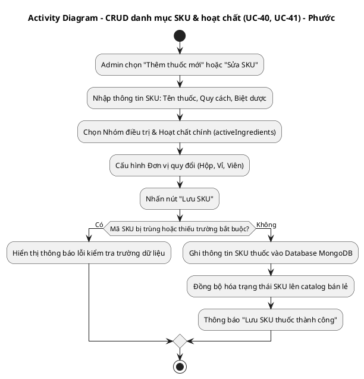
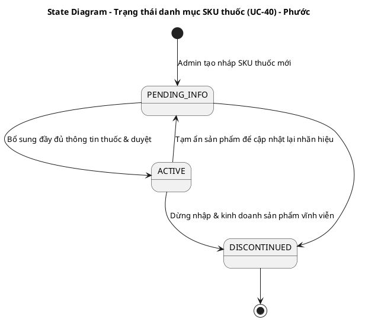
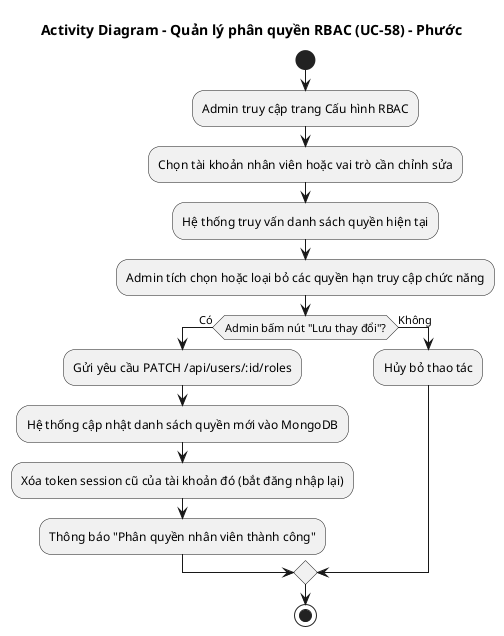
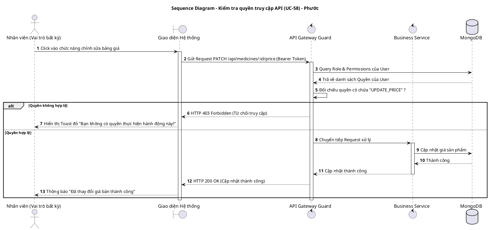
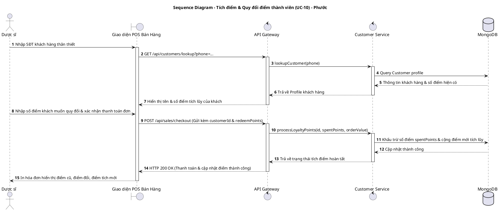
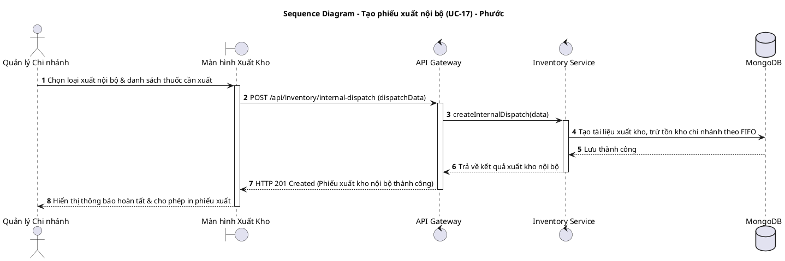
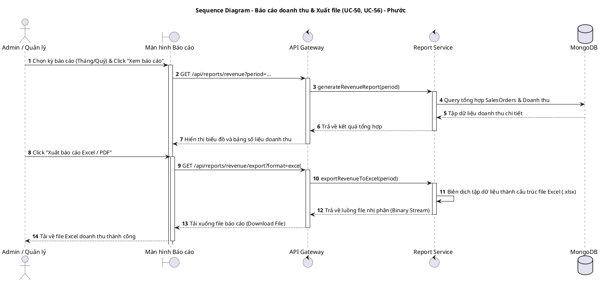

# TÀI LIỆU UML - THÀNH VIÊN: PHƯỚC (DEVELOPER)
**Danh sách UCs đã hoàn thành: UC-10, UC-17, UC-28, UC-40, UC-41, UC-50, UC-56, UC-58**

Tài liệu này chứa các luồng nghiệp vụ chi tiết và mã nguồn **PlantUML** cho toàn bộ các UCs đã hoàn thành do Phước chịu trách nhiệm thiết kế.

---

## 1. UC-40 & UC-41: QUẢN LÝ DANH MỤC THUỐC SKU, NHÓM THUỐC & HOẠT CHẤT

### A. Luồng nghiệp vụ
1. Admin truy cập trang Quản lý Sản phẩm (Catalog Management).
2. Tạo mới hoặc chỉnh sửa SKU thuốc: nhập tên thương mại, nhóm thuốc, hoạt chất chính (`activeIngredients`), hàm lượng, đơn vị quy đổi, và liên kết nhà cung cấp mặc định.
3. Hệ thống lưu trữ và đồng bộ hóa thông tin danh mục SKU thuốc.

### B. Activity Diagram (PlantUML)

### C. State Diagram (Vòng đời SKU thuốc - UC-40)

---

## 2. UC-58: QUẢN LÝ TÀI KHOẢN NGƯỜI DÙNG & PHÂN QUYỀN RBAC

### A. Luồng nghiệp vụ
1. Admin quản lý thông tin các tài khoản nhân sự (Admin, Thủ kho, Dược sĩ, Quản lý chi nhánh).
2. Gán các quyền thao tác tương thích (Create, Read, Update, Delete) trên từng API endpoint.

### B. Activity Diagram (PlantUML)

### C. Sequence Diagram (PlantUML)

---

## 3. UC-10: TÍCH ĐIỂM & QUY ĐỔI KHÁCH HÀNG THÂN THIẾT

### A. Luồng nghiệp vụ
1. Dược sĩ nhập số điện thoại khách hàng khi lập hóa đơn tại POS.
2. Hệ thống truy vấn điểm hiện có, cho phép quy đổi điểm ra tiền giảm trừ hóa đơn.
3. Khi hoàn tất hóa đơn, tích lũy điểm mới dựa trên tổng giá trị thanh toán thực tế của khách hàng.

### B. Sequence Diagram (PlantUML)

---

## 4. UC-17: TẠO PHIẾU XUẤT NỘI BỘ (KHÔNG BÁN)

### A. Luồng nghiệp vụ
1. Chi nhánh tạo phiếu xuất kho nội bộ phục vụ mục đích luân chuyển hàng hoặc làm hàng tặng, kiểm nghiệm nội bộ doanh nghiệp.

### B. Sequence Diagram (PlantUML)

---

## 5. UC-28: ĐỒNG BỘ DANH MỤC & GIÁ BÁN TOÀN CHUỖI

### A. Luồng nghiệp vụ
1. Admin thay đổi giá bán gốc của một SKU thuốc hoặc cập nhật danh mục hoạt chất.
2. Hệ thống gửi thông điệp đồng bộ hóa thông tin giá bán mới xuống cơ sở dữ liệu của tất cả các chi nhánh nhà thuốc trong chuỗi thời gian thực.

### B. Communication Diagram (PlantUML)

```plantuml
@startuml
title Communication Diagram - Đồng bộ giá bán toàn chuỗi (UC-28) - Phước
object "Admin" as Owner
object "Giao diện Catalog" as UI
object "Gateway" as Gateway
object "Medicine Service" as MedService
object "Database MongoDB" as DB

Owner -> UI : "1: Chỉnh sửa giá bán lẻ gốc của thuốc"
UI -> Gateway : "2: PATCH /api/medicines/:id/price"
Gateway -> MedService : "3: updateMedicinePrice(id, price)"
MedService -> DB : "4: Cập nhật giá bán lẻ gốc của SKU thuốc"
DB --> MedService : "5: Đã cập nhật thành công"
MedService -> DB : "6: Tự động cập nhật bảng giá của các chi nhánh trực thuộc"
DB --> MedService : "7: Đồng bộ hoàn tất"
MedService --> Gateway : "8: Phản hồi thông báo cập nhật thành công"
Gateway --> UI : "9: Hiển thị Toast "Bảng giá toàn chuỗi đã được đồng bộ""
@enduml
```

---

## 6. UC-50 & UC-56: BÁO CÁO DOANH THU & XUẤT DỮ LIỆU EXCEL / PDF

### A. Luồng nghiệp vụ
1. Admin / Quản lý chọn thời gian và bấm kết xuất báo cáo doanh số chi tiết.
2. Hệ thống tổng hợp dữ liệu giao dịch hóa đơn bán hàng và cho phép tải xuống file báo cáo định dạng Excel / PDF.

### B. Sequence Diagram (PlantUML)

---

## 💻 HƯỚNG DẪN XUẤT ẢNH BẰNG PLANTTEXT
1. Truy cập [https://www.planttext.com](https://www.planttext.com)
2. Copy đoạn mã từ `@startuml` đến `@enduml` dán vào khung bên trái.
3. Bấm **Generate** để kết xuất ảnh PNG chất lượng cao.
