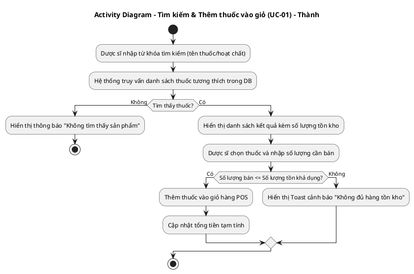
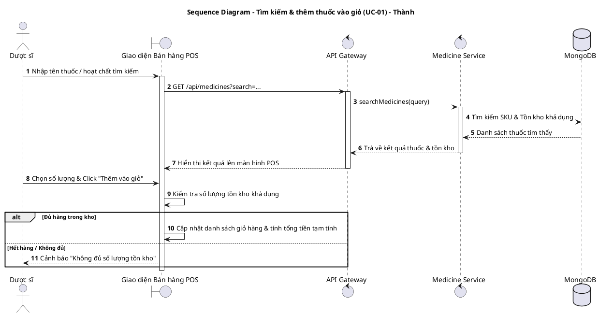
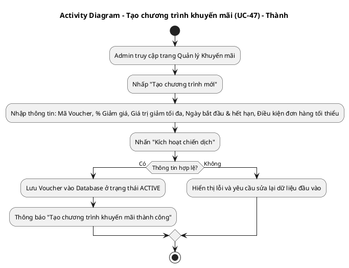
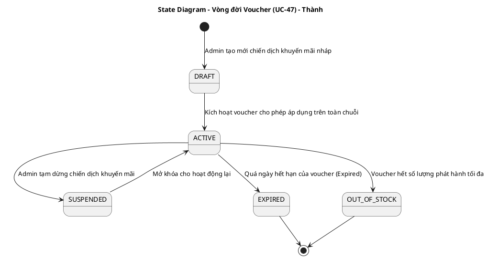
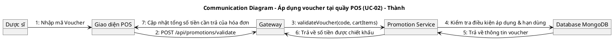
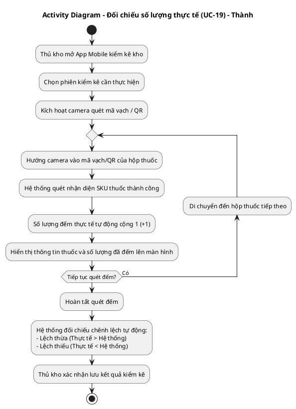
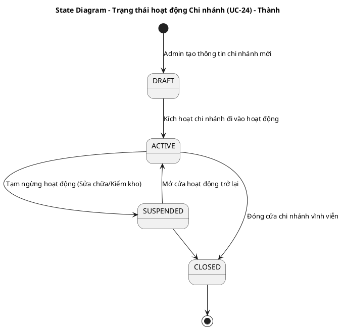
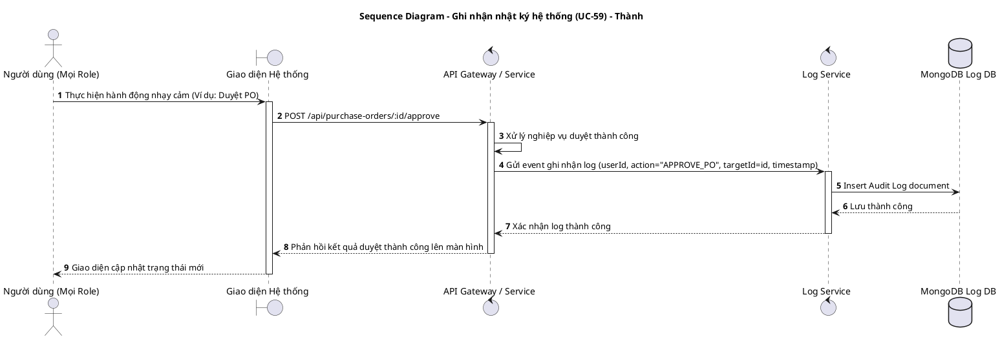

# TÀI LIỆU UML - THÀNH VIÊN: THÀNH (THỦ KHO KHO TỔNG / DEVELOPER)
**Danh sách UCs đã hoàn thành: UC-01, UC-02, UC-19, UC-24, UC-47, UC-59**

Tài liệu này chứa các luồng nghiệp vụ chi tiết và mã nguồn **PlantUML** cho toàn bộ các UCs đã hoàn thành do Thành chịu trách nhiệm.

---

## 1. UC-01: TÌM KIẾM & THÊM THUỐC VÀO GIỎ HÀNG

### A. Luồng nghiệp vụ
1. Dược sĩ nhập tên thuốc, hoạt chất hoặc quét barcode thuốc tại màn hình POS bán lẻ.
2. Hệ thống kiểm tra số lượng tồn kho khả dụng của chi nhánh hiện tại.
3. Nếu thuốc còn tồn kho, dược sĩ nhập số lượng cần mua và click "Thêm vào giỏ".
4. Giỏ hàng cập nhật danh sách thuốc, đơn giá và tính tổng tiền tạm tính.

### B. Activity Diagram (PlantUML)

### C. Sequence Diagram (PlantUML)

---

## 2. UC-02 & UC-47: QUẢN LÝ VÀ ÁP DỤNG CHƯƠNG TRÌNH KHUYẾN MÃI (VOUCHER)

### A. Luồng nghiệp vụ
1. **Tạo chương trình khuyến mãi (UC-47):** Admin thiết lập chiến dịch khuyến mãi mới (mã giảm giá, chiết khấu phần trăm, điều kiện áp dụng, hạn dùng).
2. **Áp dụng mã giảm giá tại quầy POS (UC-02):** Dược sĩ nhập mã voucher vào giỏ hàng, hệ thống kiểm tra tính hợp lệ và tự động giảm trừ tổng hóa đơn.

### B. Activity Diagram (Tạo Voucher - UC-47)

### C. State Diagram (Vòng đời Voucher - UC-47)

### D. Communication Diagram (Áp dụng Voucher tại POS - UC-02)

---

## 3. UC-19: SCAN BARCODE & ĐỐI CHIẾU SỐ LƯỢNG THỰC TẾ KHI KIỂM KÊ

### A. Luồng nghiệp vụ
1. Thủ kho mở camera trên ứng dụng Mobile tại màn hình kiểm kê kho (`StocktakeScreen`).
2. Tiến hành quét mã Barcode/QR Code của từng hộp/thùng thuốc trên kệ.
3. Hệ thống tự động nhận diện mã thuốc và tăng số lượng đếm thực tế lên +1 mỗi lần quét.
4. Hiển thị đối chiếu trực tiếp giữa Số lượng thực tế đếm được và Số lượng tồn kho lý thuyết trên hệ thống.

### B. Activity Diagram (PlantUML)

---

## 4. UC-24: QUẢN LÝ CHI NHÁNH (ADD / EDIT / DELETE)

### A. Luồng nghiệp vụ
1. Admin truy cập màn hình quản trị chi nhánh để tạo mới, chỉnh sửa thông tin hoặc tạm đóng cửa một chi nhánh trong chuỗi nhà thuốc.

### B. State Diagram (Trạng thái chi nhánh - UC-24)

---

## 5. UC-59: GHI NHẬN NHẬT KÝ HỆ THỐNG (AUDIT LOG)

### A. Luồng nghiệp vụ
1. Bất kỳ người dùng nào thực hiện hành động làm biến động dữ liệu quan trọng (Bán hàng, duyệt PO, nhập kho, sửa bảng giá, điều chỉnh quyền).
2. Hệ thống tự động ghi lại bản ghi Audit Log: Ai làm, làm gì, trên tài nguyên nào, thời gian nào và lưu vào MongoDB.

### B. Sequence Diagram (PlantUML)

---

## 💻 HƯỚNG DẪN XUẤT ẢNH BẰNG PLANTTEXT
1. Truy cập [https://www.planttext.com](https://www.planttext.com)
2. Copy đoạn mã từ `@startuml` đến `@enduml` dán vào khung bên trái.
3. Bấm **Generate** để kết xuất ảnh PNG chất lượng cao.
