# TÀI LIỆU UML - THÀNH VIÊN: THÀNH (THỦ KHO KHO TỔNG / DEVELOPER)
**Danh sách UCs đã hoàn thành: UC-01, UC-02, UC-19, UC-24, UC-25, UC-39, UC-47, UC-59, Mobile-Login**

Tài liệu này chứa các luồng nghiệp vụ chi tiết và mã nguồn **PlantUML** cho toàn bộ các UCs đã hoàn thành do Thành chịu trách nhiệm.

---

## 1. UC-01: TÌM KIẾM & THÊM THUỐC VÀO GIỎ HÀNG

### A. Luồng nghiệp vụ
1. Dược sĩ nhập tên thuốc, hoạt chất hoặc quét barcode thuốc tại màn hình POS bán lẻ.
2. Hệ thống kiểm tra số lượng tồn kho khả dụng của chi nhánh hiện tại.
3. Nếu thuốc còn tồn kho, dược sĩ nhập số lượng cần mua và click "Thêm vào giỏ".
4. Giỏ hàng cập nhật danh sách thuốc, đơn giá và tính tổng tiền tạm tính.

### B. Activity Diagram (PlantUML)
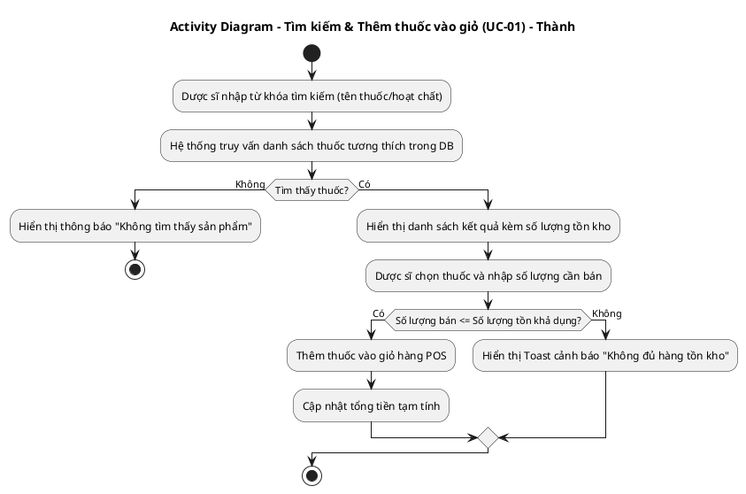

### C. Sequence Diagram (PlantUML)
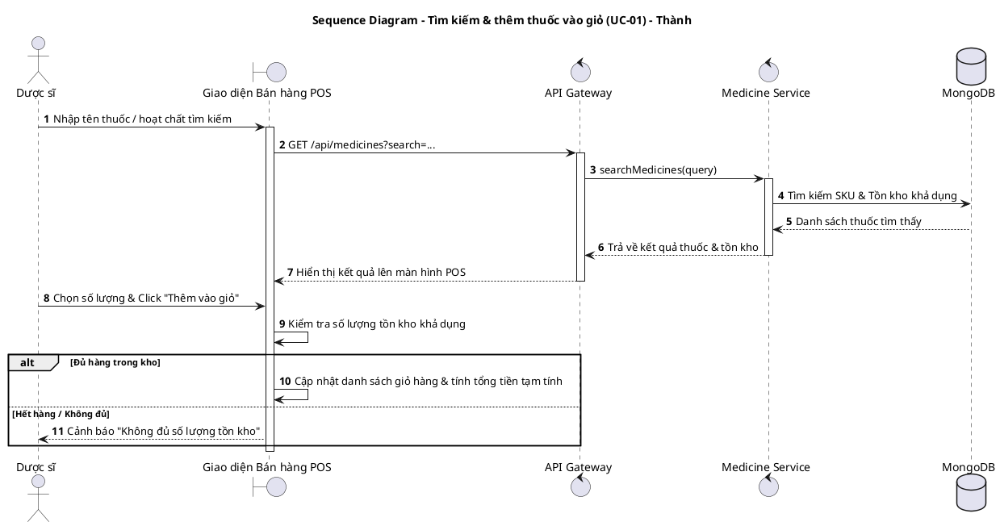

---

## 2. UC-02 & UC-47: QUẢN LÝ VÀ ÁP DỤNG CHƯƠNG TRÌNH KHUYẾN MÃI (VOUCHER)

### A. Luồng nghiệp vụ
1. **Tạo chương trình khuyến mãi (UC-47):** Admin thiết lập chiến dịch khuyến mãi mới (mã giảm giá, chiết khấu phần trăm, điều kiện áp dụng, hạn dùng).
2. **Áp dụng mã giảm giá tại quầy POS (UC-02):** Dược sĩ nhập mã voucher vào giỏ hàng, hệ thống kiểm tra tính hợp lệ và tự động giảm trừ tổng hóa đơn.

### B. Activity Diagram (Tạo Voucher - UC-47)
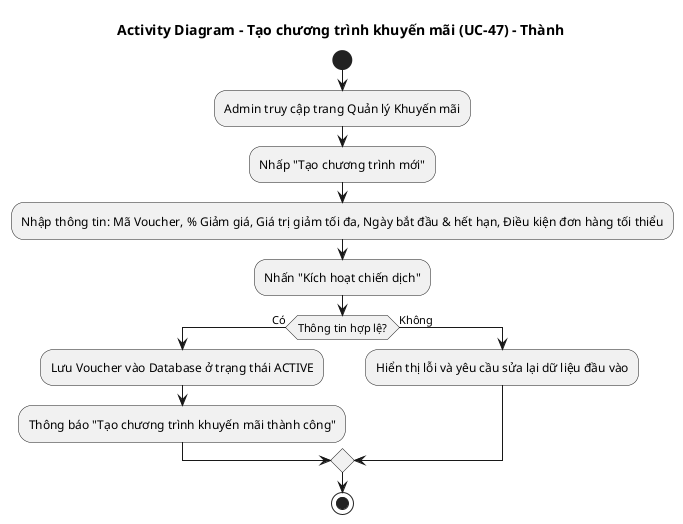

### C. State Diagram (Vòng đời Voucher - UC-47)
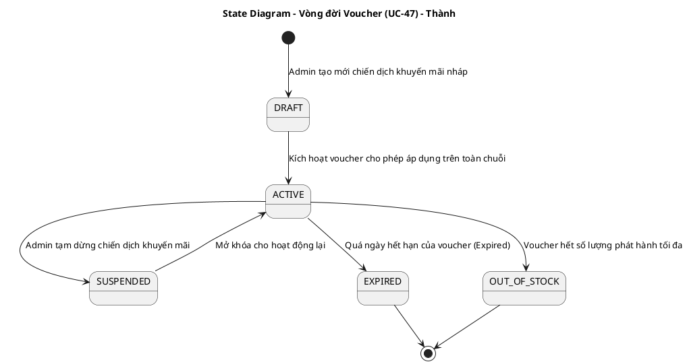

### D. Communication Diagram (Áp dụng Voucher tại POS - UC-02)
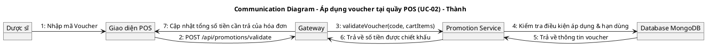

---

## 3. UC-19: SCAN BARCODE & ĐỐI CHIẾU SỐ LƯỢNG THỰC TẾ KHI KIỂM KÊ

### A. Luồng nghiệp vụ
1. Thủ kho mở camera trên ứng dụng Mobile tại màn hình kiểm kê kho (`StocktakeScreen`).
2. Tiến hành quét mã Barcode/QR Code của từng hộp/thùng thuốc trên kệ.
3. Hệ thống tự động nhận diện mã thuốc và tăng số lượng đếm thực tế lên +1 mỗi lần quét.
4. Hiển thị đối chiếu trực tiếp giữa Số lượng thực tế đếm được và Số lượng tồn kho lý thuyết trên hệ thống.

### B. Activity Diagram (PlantUML)
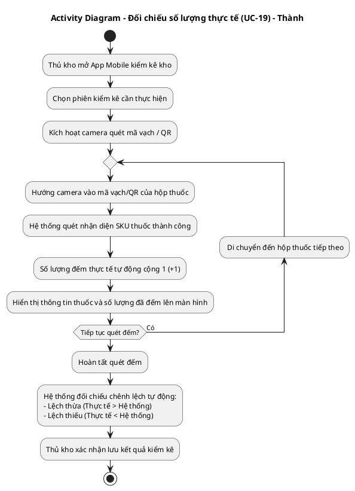

---

## 4. UC-24: QUẢN LÝ CHI NHÁNH (ADD / EDIT / DELETE)

### A. Luồng nghiệp vụ
1. Admin truy cập màn hình quản trị chi nhánh để tạo mới, chỉnh sửa thông tin hoặc tạm đóng cửa một chi nhánh trong chuỗi nhà thuốc.

### B. State Diagram (Trạng thái chi nhánh - UC-24)
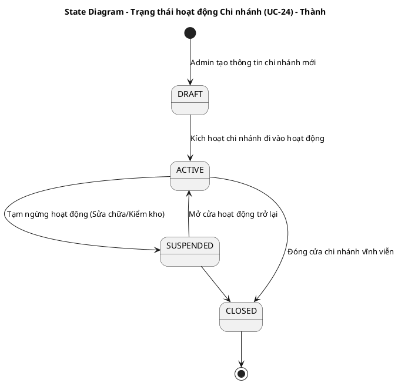

---

## 5. UC-59: GHI NHẬN NHẬT KÝ HỆ THỐNG (AUDIT LOG)

### A. Luồng nghiệp vụ
1. Bất kỳ người dùng nào thực hiện hành động làm biến động dữ liệu quan trọng (Bán hàng, duyệt PO, nhập kho, sửa bảng giá, điều chỉnh quyền).
2. Hệ thống tự động ghi lại bản ghi Audit Log: Ai làm, làm gì, trên tài nguyên nào, thời gian nào và lưu vào MongoDB.

### B. Sequence Diagram (PlantUML)
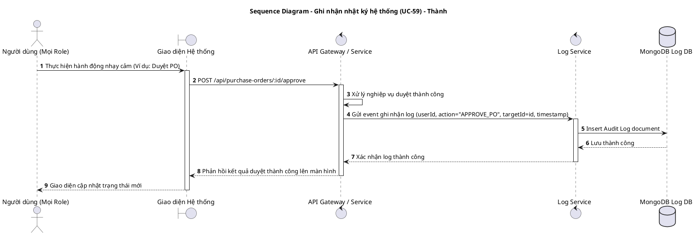

---

## 6. UC-25: DASHBOARD TỔNG – XEM DOANH THU & TỒN KHO TOÀN CHUỖI

### A. Luồng nghiệp vụ
1. Admin hoặc Quản lý chi nhánh truy cập trang Báo cáo.
2. Hệ thống giải mã token JWT để xác định phân quyền (Role) của người dùng:
   - Admin/HQ: Có thể xem dữ liệu toàn chuỗi hoặc lọc dữ liệu theo từng chi nhánh.
   - Quản lý chi nhánh (Branch Manager): Chỉ có thể xem dữ liệu của chi nhánh mình.
   - Dược sĩ (Pharmacist): Chỉ được xem một số chỉ số doanh thu bán lẻ cơ bản tại quầy của chi nhánh đó, các tab BI chuyên sâu sẽ bị ẩn.
3. Client thực hiện gọi API `GET /api/reports/dashboard/summary` qua Gateway để lấy dữ liệu tổng quan.
4. Gateway định tuyến và gửi song song qua Kafka/gọi HTTP (sử dụng `Promise.all` để tối ưu hóa hiệu năng) tới:
   - **Orders Service**: Tổng hợp và tính toán Doanh thu thuần (Net Revenue = Doanh thu gộp - Tiền trả hàng + Chênh lệch đổi hàng).
   - **Inventory Service**: Tính toán Tổng giá trị tồn kho, Cảnh báo thuốc sắp hết hạn (Expired), và số lượng thuốc dưới mức an toàn (Reorder Point).
5. Frontend hiển thị nhanh các KPI Cards. Các tab phân tích sâu (BI Analytics, Hiệu suất kho) được thiết lập Lazy loading (`React.lazy`) và chỉ load code + gọi API chi tiết khi người dùng click chọn tab.

### B. Activity Diagram (PlantUML)
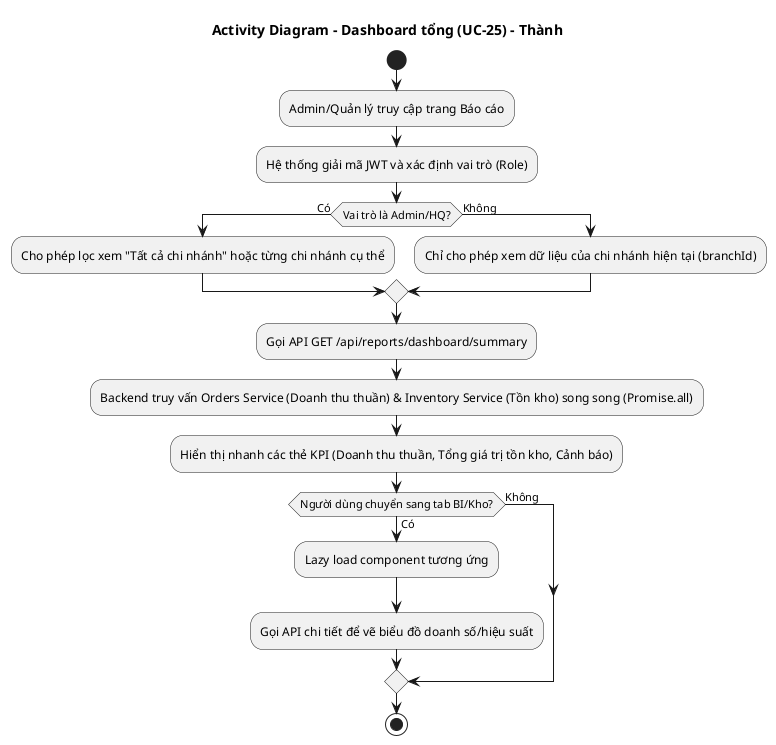

### C. Sequence Diagram (PlantUML)
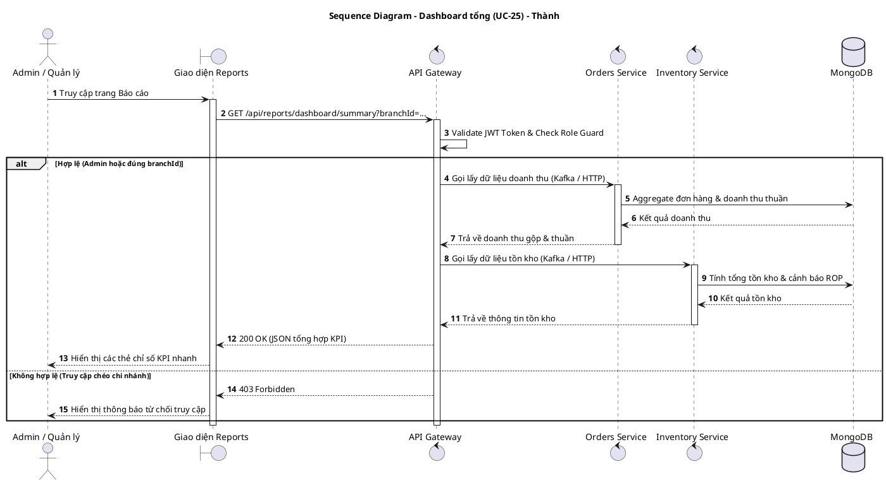

---

## 7. UC-39: PHÂN TÍCH XU HƯỚNG BÁN HÀNG THEO MÙA / DỊCH BỆNH (AI INSIGHTS)

### A. Luồng nghiệp vụ
1. Người dùng (Admin hoặc Quản lý chi nhánh) truy cập Tab **Xu hướng mùa & dịch bệnh (AI)** trên trang Báo cáo.
2. Hệ thống kiểm tra trong Redis cache key `reports:seasonal-analysis:{branchId}:{currentMonth}` (Cơ chế Cache-Aside).
   - Nếu có cache (Cache Hit): Trả về ngay kết quả phân tích trong vòng vài mili-giây để tối ưu trải nghiệm.
   - Nếu không có cache (Cache Miss): Hệ thống kích hoạt quy trình phân tích lai (Hybrid AI).
3. **Quy trình phân tích lai (Hybrid AI):**
   - **Bước 1 (Tính toán định lượng):** Backend truy vấn lịch sử bán hàng 12 tháng gần nhất, đồng thời truy vấn Lead Time và MOQ của nhà cung cấp liên đới.
   - **Bước 2 (Giải thuật dự báo):** Gửi dữ liệu thô sang Python AI Service. Nếu số điểm dữ liệu lịch sử >= 4, sử dụng **Hồi quy tuyến tính (Linear Regression)** để xác định đường xu hướng và dự phòng 3 tháng tiếp theo. Nếu < 4, sử dụng **Trung bình trượt (Moving Average)**. Tính toán khoảng tin cậy 95% (Confidence Interval) và sai số để cho ra điểm số **Forecast Confidence**.
   - **Bước 3 (Lập luận AI & Guardrails):** Dữ liệu được đưa qua Groq LLM (Llama-3.3) để phân tích yếu tố vùng miền khí hậu Việt Nam & các mùa dịch tễ học đặc trưng. Áp dụng Epidemic Guardrails nghiêm ngặt (ví dụ: chỉ cảnh báo nguy cơ sốt xuất huyết khi nhóm thuốc chỉ báo gồm Paracetamol + Oresol + Thuốc xịt muỗi cùng tăng). LLM tự đánh giá **Explainability Confidence**.
   - **Bước 4 (Caching):** Lưu kết quả vào Redis Cache với TTL 24 giờ.
4. **Vô hiệu hóa cache tự động (Cache Eviction):** Khi có đơn bán hàng mới (`createSalesOrder`) hoặc phiếu nhập kho hoàn tất (`approveGoodsReceiptNote`), hệ thống tự động xóa cache của chi nhánh để đảm bảo tính thời gian thực ở lần tải tiếp theo. Người dùng cũng có thể bấm nút "Làm mới phân tích" để xóa cache thủ công.
5. **Tạo đơn PR điền sẵn thông tin (Prefill PR):** Tại bảng khuyến nghị tăng tồn kho, người dùng có thể bấm nút **"Nhập hàng"**. Hệ thống sẽ chuyển hướng sang trang tạo Yêu cầu mua hàng (PR - đối với Chi nhánh) hoặc Đơn đặt hàng (PO - đối với HQ) với các thông tin được điền sẵn từ AI: ID thuốc, số lượng đề xuất, và lý do AI đề xuất làm chứng cứ lưu vết (`isAiGenerated: true`, `aiConfidence`, `aiReason`, `aiAnalysisVersion`).

### B. Activity Diagram (PlantUML)
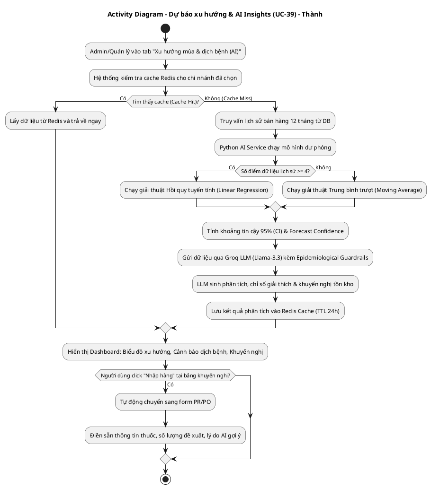

### C. Sequence Diagram (PlantUML)
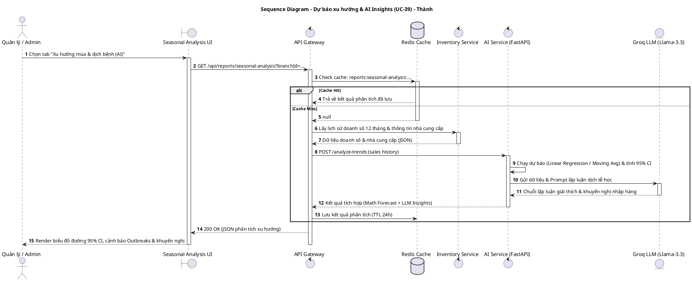

---

## 8. MOBILE: ĐĂNG NHẬP GOOGLE TRÊN DI ĐỘNG

### A. Luồng nghiệp vụ
1. Người dùng mở ứng dụng di động trên điện thoại, tại màn hình Login chọn "Đăng nhập bằng Google".
2. Hệ thống mở một màn hình `GoogleWebViewScreen` để tải trang đăng nhập OAuth 2.0 chính thức của Google.
3. Người dùng nhập email và mật khẩu Google, sau đó xác nhận cấp quyền truy cập.
4. Google thực hiện xác thực và redirect về Callback URL cấu hình sẵn kèm mã ủy quyền Authorization Code.
5. Ứng dụng Mobile lắng nghe sự thay đổi của WebView, trích xuất mã code từ URL và gửi nó lên Backend (`POST /api/auth/google-login`).
6. Backend (Auth Service) dùng mã code này để trao đổi với Google API lấy User Profile (Email, Họ tên).
7. Hệ thống tìm kiếm User theo Email trong MongoDB. Nếu chưa tồn tại, tự động tạo mới tài khoản với vai trò (Role) mặc định.
8. Backend trả về JWT Access Token cho ứng dụng Mobile.
9. Mobile lưu trữ token vào bộ nhớ an toàn (Secure Storage) và chuyển hướng người dùng vào màn hình chính của Thủ kho (`WarehouseScreen`) hoặc Dược sĩ (`PharmacistScreen`).

### B. Activity Diagram (PlantUML)
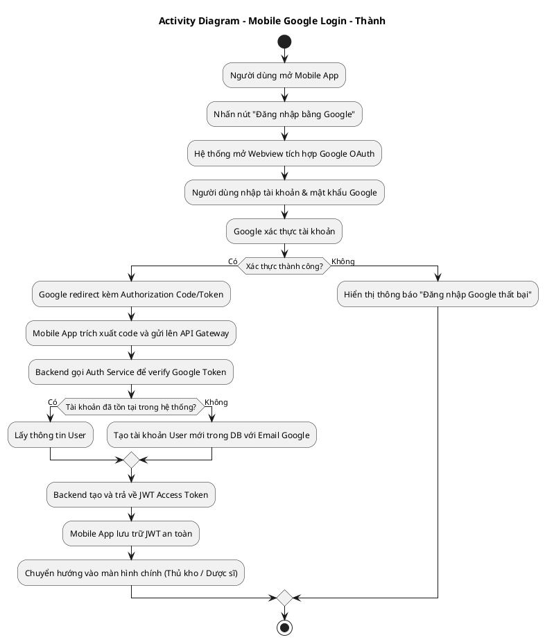

### C. Sequence Diagram (PlantUML)
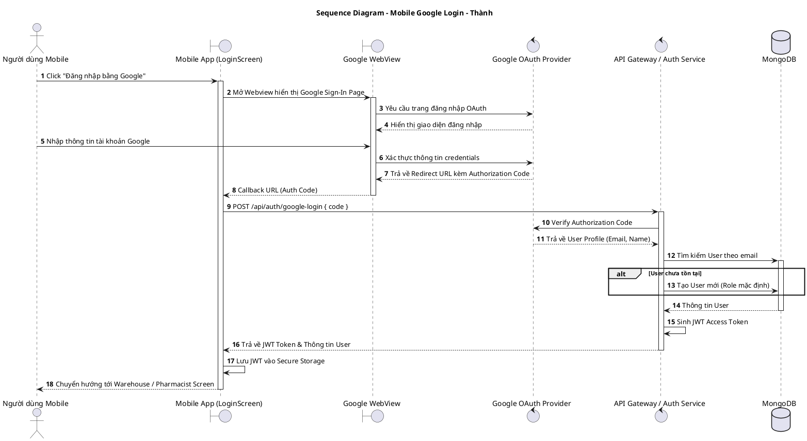

---

## 9. 📝 KỊCH BẢN DEMO & TEST LIỀN MẠCH THEO LUỒNG NGHIỆP VỤ (DÀNH CHO GIÁO VIÊN)

Để buổi Demo đạt hiệu quả cao nhất và thuyết phục người chấm, kịch bản dưới đây được thiết kế theo **Luồng nghiệp vụ thực tế (User Journey)** thay vì liệt kê rời rạc theo số thứ tự UC. 

Sự sắp xếp này giúp bạn **kể một câu chuyện vận hành khép kín** (từ lúc Cấu hình -> Bán lẻ -> Kiểm kho -> Xem báo cáo & AI gợi ý -> Kiểm tra nhật ký bảo mật) giúp tiết kiệm thời gian chuyển đổi tài khoản và thiết bị.

---

### PHẦN 1: CẤU HÌNH HỆ THỐNG BAN ĐẦU (ADMIN WEB)
*Mục tiêu: Đăng nhập quyền cao nhất để thiết lập mạng lưới chi nhánh và chương trình khuyến mãi chuẩn bị cho hoạt động kinh doanh.*

| Bước Demo | Chức năng (UC) | Vai trò | Giao diện & Thao tác | Kết quả mong đợi (Bằng chứng chứng minh) |
| :--- | :--- | :--- | :--- | :--- |
| **Bước 1** | **UC-24: Quản lý chi nhánh** | `admin` | - Vào trang **Quản lý chi nhánh** (`/admin/branches`). - Click **"Thêm chi nhánh"** -> Điền thông tin chi nhánh mới. - Click nút thay đổi trạng thái hoạt động (ví dụ: Active -> Suspended -> Closed). | - Chi nhánh mới được hiển thị ngay lập tức trong bảng dữ liệu. - Trạng thái hoạt động thay đổi màu sắc trực quan (Suspended - cam, Closed - đỏ, Active - xanh). |
| **Bước 2** | **UC-47: Tạo Voucher** | `admin` | - Vào trang **Quản lý Voucher** (`/admin/vouchers`). - Click **"Tạo chương trình mới"**. - Tạo một mã Voucher mới: ví dụ `DEMO20` (Giảm 20% cho đơn tối thiểu từ 100k, kích hoạt trạng thái `ACTIVE`). | - Voucher mới xuất hiện trong danh sách với trạng thái `ACTIVE` (đồng bộ trực tiếp trong MongoDB). |

---

### PHẦN 2: BÁN LẺ TẠI QUẦY & ÁP DỤNG KHUYẾN MÃI (PHARMACIST POS)
*Mục tiêu: Thực hiện bán thuốc cho khách hàng, chứng minh tính năng tìm kiếm, giỏ hàng, cảnh báo tồn kho và cơ chế trừ tiền của Voucher vừa tạo ở Phần 1.*

| Bước Demo | Chức năng (UC) | Vai trò | Giao diện & Thao tác | Kết quả mong đợi (Bằng chứng chứng minh) |
| :--- | :--- | :--- | :--- | :--- |
| **Bước 3** | **UC-01: Bán lẻ & Giỏ hàng POS** | `pharmacist` / Khách hàng | - Vào màn hình POS bán lẻ tại quầy hoặc Shop Khách hàng. - Tìm kiếm thuốc bằng từ khóa (ví dụ: `Paracetamol`). - Chọn thuốc, nhập số lượng cần bán và bấm **"Thêm vào giỏ"**. - **Test Cảnh báo:** Nhập số lượng lớn vượt quá số tồn kho khả dụng hiện tại. | - Giỏ hàng cập nhật tức thì: hiển thị tên thuốc, số lượng, đơn giá, tổng tạm tính. - Hệ thống hiển thị Toast cảnh báo đỏ *"Không đủ hàng tồn kho"* khi nhập quá số lượng khả dụng. |
| **Bước 4** | **UC-02: Áp dụng Voucher tại POS** | `pharmacist` | - Tại giỏ hàng POS (đơn hàng đạt trên 100k), nhập mã Voucher `DEMO20` (được tạo ở Bước 2) và click áp dụng. - Nhấn thanh toán để hoàn tất đơn hàng. | - Hệ thống tự động kiểm tra điều kiện áp dụng, giảm trừ 20% trên tổng giá trị hóa đơn. - Màn hình POS hiển thị chi tiết số tiền được chiết khấu và tổng số tiền khách cần trả sau giảm giá. |

---

### PHẦN 3: VẬN HÀNH KHO & ĐỒNG BỘ DI ĐỘNG (MOBILE APP)
*Mục tiêu: Chuyển sang thiết bị di động, chứng minh tính năng đăng nhập không mật khẩu bằng Google và tiến hành kiểm kê thực tế bằng quét Barcode/QR Code.*

| Bước Demo | Chức năng (UC) | Vai trò | Giao diện & Thao tác | Kết quả mong đợi (Bằng chứng chứng minh) |
| :--- | :--- | :--- | :--- | :--- |
| **Bước 5** | **Đăng nhập Google trên Mobile** | Thủ kho (`warehouse`) | - Mở ứng dụng di động. - Tại màn hình đăng nhập, bấm chọn **"Đăng nhập bằng Google"**. - Tiến hành nhập tài khoản Gmail trên giao diện WebView Google OAuth. | - Xác thực thành công, hệ thống tự động nhận diện tài khoản, lấy JWT Token lưu vào secure storage và dẫn thẳng vào màn hình chức năng của Thủ kho. |
| **Bước 6** | **UC-19: Kiểm kê kho bằng Barcode** | Thủ kho (`warehouse`) | - Trên Mobile App, vào màn hình **Kiểm kê kho (Stocktake)**. - Kích hoạt camera quét mã vạch/QR trên hộp thuốc thực tế trên kệ. | - Camera nhận diện mã vạch cực nhanh, tự động tăng số lượng đếm thực tế lên +1 sau mỗi lần quét. - Màn hình hiển thị đối chiếu trực quan chênh lệch Lệch thừa / Lệch thiếu so với tồn kho lý thuyết trên hệ thống để thủ kho xác nhận và lưu. |

---

### PHẦN 4: BÁO CÁO DOANH THU, DỰ BÁO AI & GIÁM SÁT REAL-TIME (ADMIN WEB)
*Mục tiêu: Đăng nhập lại Admin để xem bức tranh tổng thể sau giao dịch bán hàng, xem dự báo xu hướng mùa của AI và chứng minh tính minh bạch của toàn bộ hệ thống thông qua Audit Log.*

| Bước Demo | Chức năng (UC) | Vai trò | Giao diện & Thao tác | Kết quả mong đợi (Bằng chứng chứng minh) |
| :--- | :--- | :--- | :--- | :--- |
| **Bước 7** | **UC-25: Dashboard tổng toàn chuỗi** | `admin` | - Vào trang **Báo cáo & Dashboard** (`/admin/reports`). - Xem các thẻ KPI Doanh thu thuần, Tổng giá trị tồn kho. - Chuyển đổi dropdown chi nhánh để xem lọc số liệu. - Click tab **Phân tích doanh thu (BI)**. | - Doanh thu thuần cập nhật tăng thêm ngay lập tức sau đơn hàng ở Bước 4. - **Chứng minh Lazy loading:** Bật Tab Network trong DevTools để chứng minh bundle JS của các tab BI chỉ được tải xuống máy khách khi người dùng click chọn tab. |
| **Bước 8** | **UC-39: Dự báo xu hướng AI & PR Prefill** | `admin` / `branch` | - Tại trang Báo cáo, chọn tab **Xu hướng mùa & dịch bệnh (AI)**. - Xem biểu đồ dự báo 95% Confidence Interval (Toán học) và cảnh báo bùng phát dịch bệnh (Groq LLM). - Nhấn nút **"Làm mới phân tích"** để xóa cache và ép AI chạy lại từ đầu. - Tại bảng đề xuất của AI, bấm **"Nhập hàng"** cạnh dòng thuốc được đề xuất. | - Lần tải 2 báo *Cache Hit (Redis)*. Khi bấm "Làm mới phân tích", màn hình hiển thị loading tính toán mới (Cache Miss). - Khi bấm "Nhập hàng", hệ thống tự động chuyển sang form tạo PR (hoặc PO) với các thông tin đã được điền sẵn: Thuốc, Số lượng đề xuất, Lý do AI đề xuất làm chứng cứ lưu vết. |
| **Bước 9** | **UC-59: Nhật ký Audit Log Real-time** | `admin` | - Mở song song trang **Nhật ký hệ thống** (`/admin/audit-logs`). - Bạn có thể thực hiện một hành động nhanh khác (Ví dụ: tạo thêm voucher hoặc duyệt PO). | - Giao diện hiển thị trực quan nhật ký hành động dạng real-time (sử dụng Websocket): các dòng log tự động đẩy lên đầu danh sách mà không cần tải lại trang, hiển thị rõ: *Ai thực hiện, hành động gì (APPROVE_PO, CREATE_VOUCHER...), thời gian và thiết bị nào*. |

---

## 💻 HƯỚNG DẪN XUẤT ẢNH BẰNG PLANTTEXT
1. Truy cập [https://www.planttext.com](https://www.planttext.com)
2. Copy đoạn mã từ `@startuml` đến `@enduml` dán vào khung bên trái.
3. Bấm **Generate** để kết xuất ảnh PNG chất lượng cao.
