# TÀI LIỆU TOÀN DIỆN: LUỒNG NGHIỆP VỤ & HƯỚNG DẪN VẼ UML (PLANTUML)
**Hệ thống Quản trị Chuỗi Nhà thuốc & Tối ưu Kho thông minh**

Tài liệu này chi tiết hóa toàn bộ các luồng đi của tất cả các chức năng hiện có trong dự án, đồng thời cung cấp mã nguồn **PlantUML** hoàn chỉnh cho 4 loại sơ đồ (Activity, State, Sequence, Communication) của cả 5 phân hệ lớn. 

Tài liệu được cấu trúc phân chia trực quan cho 5 thành viên: **Thành, Nam, Phước, Phúc, Đạt** phối hợp thực hiện.

---

## 📌 PHÂN CHIA VAI TRÒ VẼ UML TOÀN HỆ THỐNG

1.  **PHƯỚC (Dược sĩ & Khách hàng):** Phụ trách **Phân hệ Bán hàng POS & Khách hàng tự tra cứu**.
2.  **THÀNH (Thủ kho):** Phụ trách **Phân hệ Quản lý Kho (Nhập, Xuất, Kiểm kho & Lot Tracking)**.
3.  **ĐẠT (Quản lý Chi nhánh):** Phụ trách **Phân hệ Điều phối & Luân chuyển nội bộ**.
4.  **PHÚC (Admin / HQ Manager):** Phụ trách **Phân hệ Phê duyệt PO/GRN & Quản trị Danh mục**.
5.  **NAM (AI Developer):** Phụ trách **Phân hệ Dự báo Nhu cầu AI Forecast & Quét đơn thuốc AI**.

---

## PHÂN HỆ 1: BÁN HÀNG POS & KHÁCH HÀNG TỰ TRA CỨU (PHƯỚC PHỤ TRÁCH)

### 1. Luồng nghiệp vụ
*   **Bán hàng POS tại quầy:** Dược sĩ nhập tên thuốc tìm kiếm -> Thêm vào giỏ hàng -> Hệ thống tự động kiểm tra tương tác xung khắc -> Cảnh báo hoạt chất nếu có tương tác nguy hiểm -> Nhập thông tin khách hàng thân thiết -> Áp dụng mã giảm giá -> Xác nhận thanh toán (Tiền mặt/Chuyển khoản) -> Trừ kho theo FIFO -> Tạo hóa đơn điện tử -> Gửi hóa đơn qua email khách hàng.
*   **Khách hàng tự tra cứu:** Khách hàng vãng lai truy cập shop tự phục vụ -> Tìm kiếm thuốc theo tên/hoạt chất -> Xem thông tin chi tiết -> Thêm vào giỏ hàng -> Đặt hàng -> Tra cứu lịch sử mua hàng qua số điện thoại.

### 2. Sơ đồ PlantUML (Phước)

#### A. Activity Diagram: Luồng bán hàng POS tại quầy
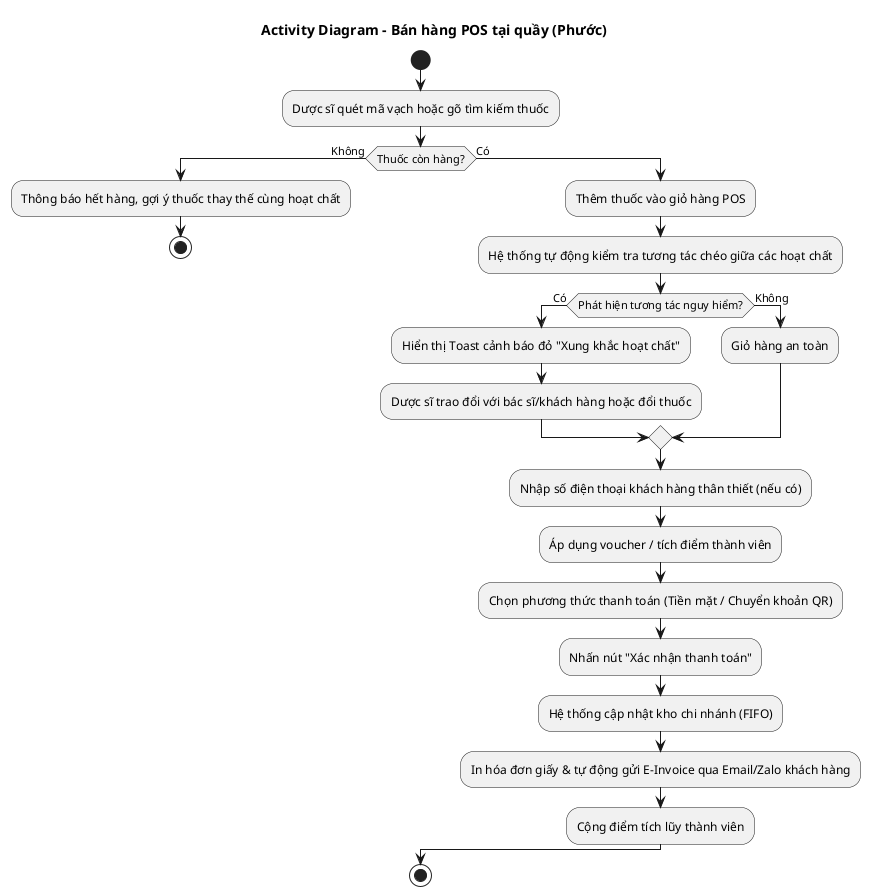

#### B. Sequence Diagram: Luồng Khách hàng tự tra cứu đơn hàng bằng SĐT
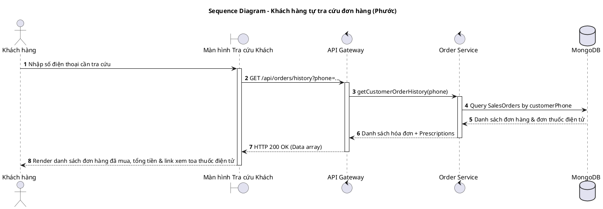

#### C. State Diagram: Trạng thái của Đơn đặt hàng bán lẻ
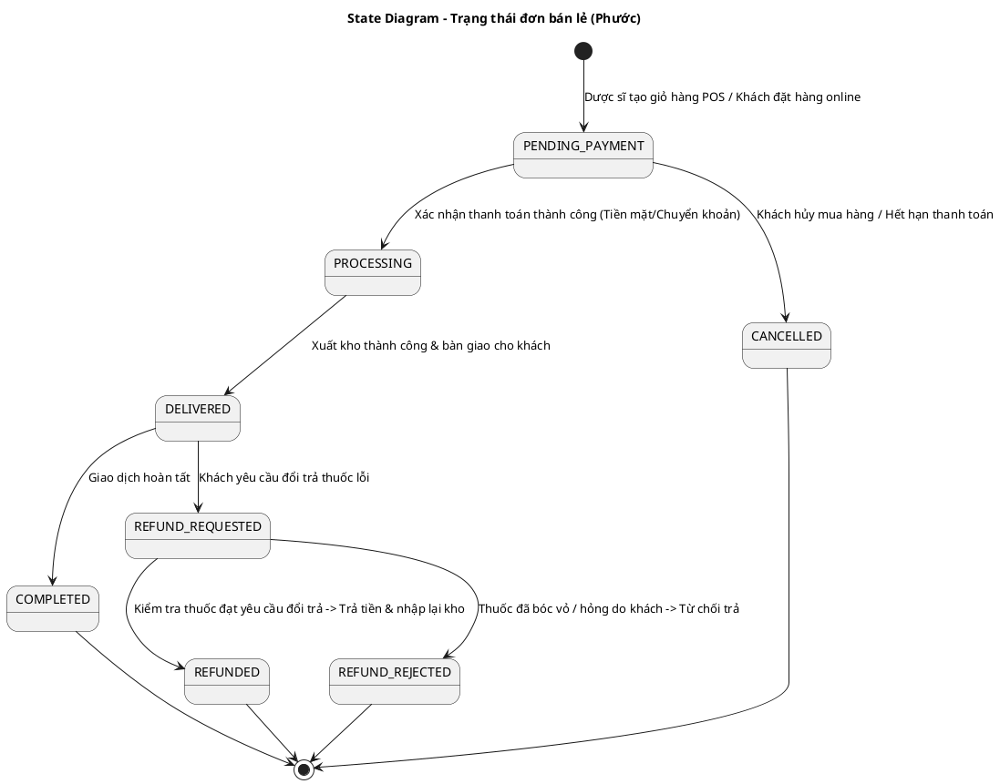

#### D. Communication Diagram: Tiến trình thanh toán POS
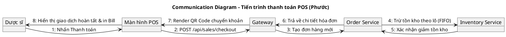

---

## PHÂN HỆ 2: QUẢN LÝ KHO - NHẬP, XUẤT, KIỂM KHO & TRUY VẾT LÔ (THÀNH PHỤ TRÁCH)

### 1. Luồng nghiệp vụ
*   **Kiểm hàng & Nhập kho (Goods Receipt Note):** Thủ kho nhận hàng giao từ nhà cung cấp theo PO -> Tạo Phiên kiểm hàng (Inspection Record) -> Quét đếm số lượng thực tế nhận được (hỗ trợ đếm nhanh bằng camera AI) -> Ghi nhận lỗi hỏng nếu có -> Lưu mã số lô (`batchNo`) và Hạn sử dụng (`expDate`) của từng thuốc -> Tạo GRN gửi Admin duyệt nhập kho.
*   **Xuất hủy thuốc hết hạn (Dispose):** Hệ thống cảnh báo các lô hết hạn -> Thủ kho lập phiếu yêu cầu tiêu hủy -> Chờ duyệt -> Xuất kho hủy và cập nhật số lượng tồn.
*   **Truy vết lô (Lot Tracking):** Nhập mã lô -> Hệ thống truy vết ngược từ NCC -> PO -> GRN -> Lịch sử thay đổi số lượng kho theo thời gian (Timeline).

### 2. Sơ đồ PlantUML (Thành)

#### A. Activity Diagram: Luồng kiểm hàng và tạo phiếu nhập kho GRN
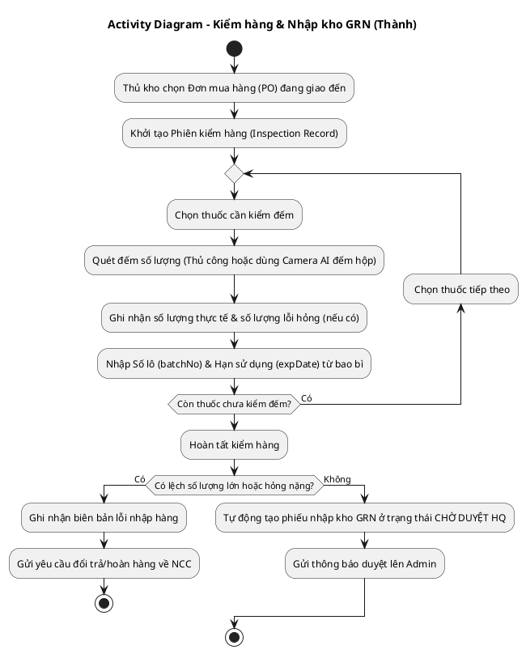

#### B. Sequence Diagram: Luồng truy xuất nguồn gốc lô hàng (Lot Tracking)
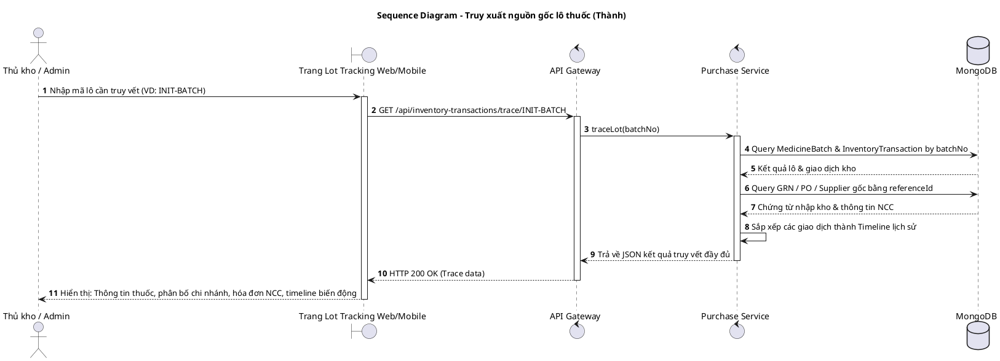

#### C. State Diagram: Trạng thái của một Phiên kiểm hàng (Inspection Record)
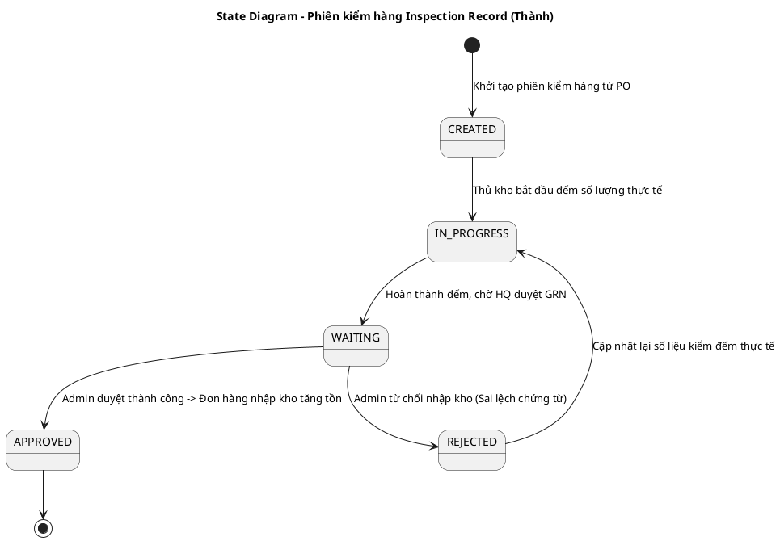

#### D. Communication Diagram: Luồng tạo phiếu xuất hủy thuốc quá hạn
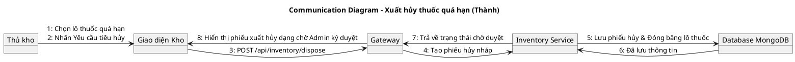

---

## PHÂN HỆ 3: ĐIỀU PHỐI & LUÂN CHUYỂN NỘI BỘ (ĐẠT PHỤ TRÁCH)

### 1. Luồng nghiệp vụ
1.  **Chi nhánh gửi yêu cầu:** Chi nhánh hết hàng tự động tạo cảnh báo hoặc Quản lý chi nhánh tạo phiếu **Yêu cầu cấp hàng (Branch Requisition)** gửi lên Kho tổng trung tâm.
2.  **Kho tổng tiếp nhận:** Thủ kho tại Kho tổng xem yêu cầu cấp hàng.
3.  **Xử lý tại Kho tổng:**
    *   Nếu Kho tổng hết hàng: Thủ kho bấm báo hết hàng (`OUT_OF_STOCK`), hệ thống kích hoạt luồng mua hàng NCC ngoài.
    *   Nếu Kho tổng còn hàng: Thủ kho nhấn duyệt, chọn lô hàng tương thích xuất kho và bàn giao đơn vị vận chuyển (`SHIPPING`).
4.  **Chi nhánh tiếp nhận:** Khi hàng đến nơi, cửa hàng trưởng chi nhánh kiểm đếm số lượng thực tế nhận được và nhấn **Xác nhận nhận hàng (Received)**. Hệ thống tự động trừ tồn kho Kho tổng và tăng tồn kho Chi nhánh nhận tương ứng.

### 2. Sơ đồ PlantUML (Đạt)

#### A. Activity Diagram: Luồng luân chuyển kho từ Kho tổng về Chi nhánh
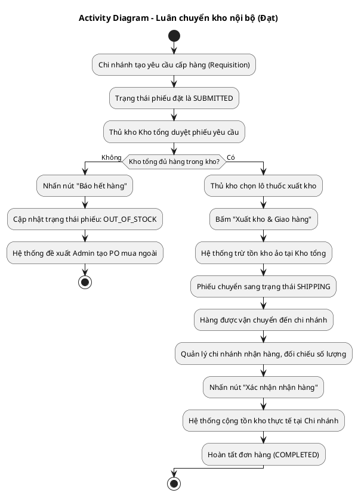

#### B. Sequence Diagram: Luồng Cửa hàng trưởng yêu cầu cấp hàng nội bộ
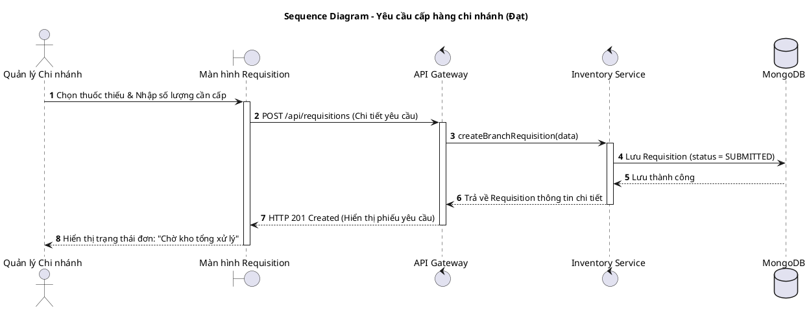

#### C. State Diagram: Trạng thái của Phiếu Yêu cầu cấp hàng (Branch Requisition)
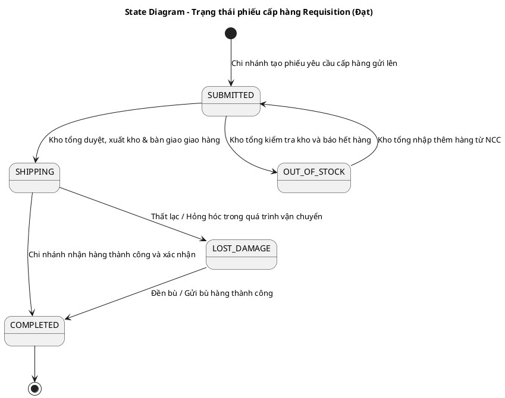

#### D. Communication Diagram: Luồng nhận hàng luân chuyển tại Chi nhánh
```plantuml
@startuml
title Communication Diagram - Nhận hàng luân chuyển tại Chi nhánh (Đạt)
object "Quản lý Chi nhánh" as Manager
object "Giao diện Nhận hàng" as UI
object "Gateway" as Gateway
object "Inventory Service" as InvService
object "Database MongoDB" as DB

Manager -> UI : "1: Kiểm đếm thực tế\n2: Nhấn Xác nhận nhận hàng"
UI -> Gateway : "3: PATCH /api/requisitions/:id/receive"
Gateway -> InvService : "4: Cập nhật tăng tồn kho Chi nhánh"
InvService -> DB : "5: Tăng stock chi nhánh\n6: Đổi trạng thái Requisition sang COMPLETED"
DB --> InvService : "7: Đã cập nhật thành công"
InvService --> Gateway : "8: Trả về trạng thái hoàn tất"
Gateway --> UI : "9: Hiển thị popup "Đã nhận hàng và tăng tồn kho thành công""
@enduml
```

---

## PHÂN HỆ 4: PHÊ DUYỆT PO/GRN & QUẢN TRỊ DANH MỤC (PHÚC PHỤ TRÁCH)

### 1. Luồng nghiệp vụ
*   **Phê duyệt PO (Purchase Order):** Admin nhận yêu cầu nhập hàng (PR) từ thủ kho -> Admin duyệt PO -> Chọn loại hình thanh toán (Thanh toán ngay hoặc Mua nợ ghi nhận công nợ NCC) -> PO chuyển sang trạng thái APPROVED -> NCC bắt đầu đóng gói giao hàng.
*   **Phê duyệt GRN (Goods Receipt Note):** Sau khi hàng được kiểm đếm tại kho, Admin kiểm tra chênh lệch trên Phiên kiểm hàng -> Nhấn duyệt GRN -> Hệ thống chính thức tăng số lượng tồn kho tổng và tạo các lô thuốc mới hoạt động trên hệ thống.
*   **Quản trị danh mục:** Admin CRUD thuốc, CRUD danh mục nhà cung cấp, cấu hình bảng giá bán toàn chuỗi và phân quyền truy cập chức năng cho nhân viên.

### 2. Sơ đồ PlantUML (Phúc)

#### A. Activity Diagram: Quy trình duyệt đơn mua hàng PO và thanh toán công nợ
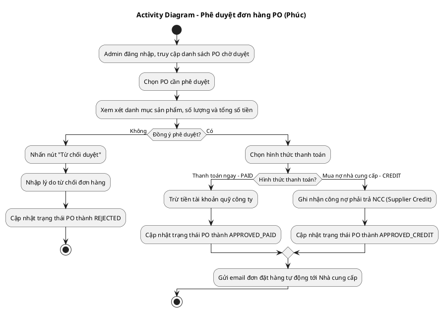

#### B. Sequence Diagram: Luồng duyệt nhập kho GRN sau khi kiểm hàng thành công
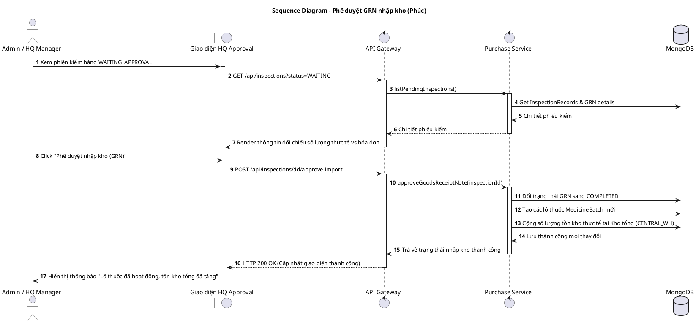

#### C. State Diagram: Trạng thái của Tài khoản nhân viên & Quyền hạn (RBAC)
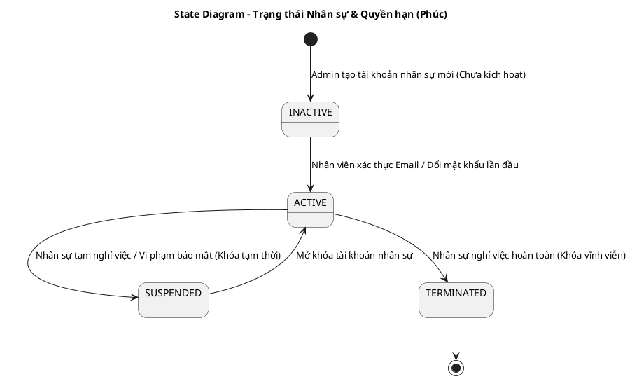

#### D. Communication Diagram: Luồng Admin cấu hình giá bán toàn chuỗi (Global Price)
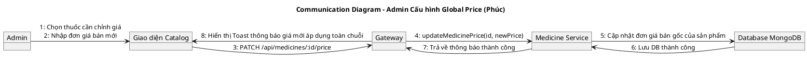

---

## PHÂN HỆ 5: AI FORECAST & AI OPERATIONS (NAM PHỤ TRÁCH)

### 1. Luồng nghiệp vụ
*   **AI Forecast (Dự báo nhu cầu nhập hàng):** Hệ thống tổng hợp lượng bán, tồn kho hiện tại và lượng hàng sắp về -> Gửi qua AI Service (FastAPI) -> LLM (Llama 3.3 70b) phân tích -> Trả về danh sách thuốc đề xuất nhập kèm độ khẩn cấp -> Thủ kho duyệt tạo nhanh PR/PO.
*   **Quét đơn thuốc AI (AI OCR Prescription):** Dược sĩ chụp đơn thuốc -> AI OCR phân tích bóc tách chữ -> Điền tự động tên thuốc vào giỏ hàng POS, giảm thiểu thời gian nhập liệu thủ công.

### 2. Sơ đồ PlantUML (Nam)

#### A. Activity Diagram: Luồng dự báo tồn kho thông minh bằng AI
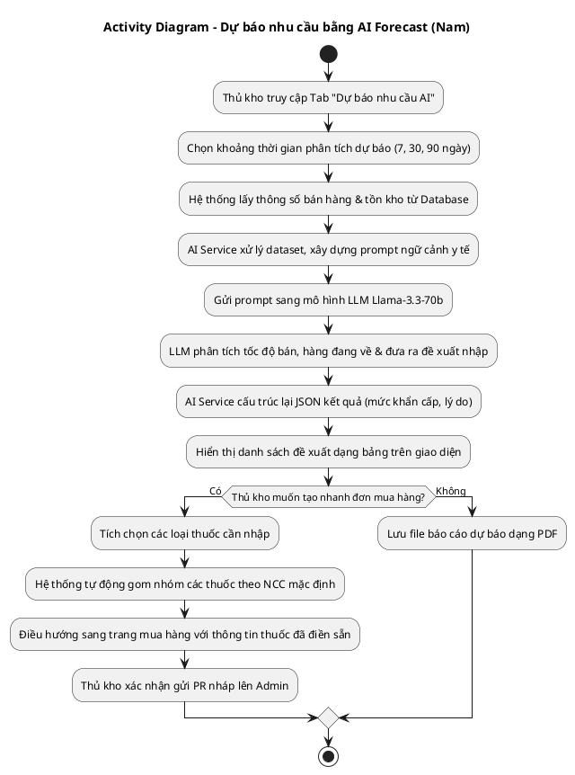

#### B. Sequence Diagram: Luồng Quét đơn thuốc bằng AI (OCR Prescription)
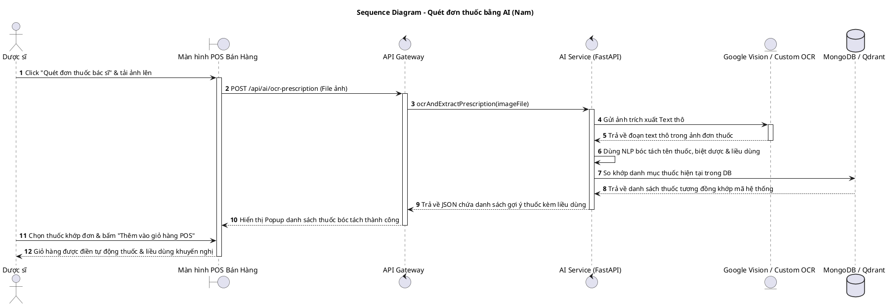

#### C. State Diagram: Trạng thái Đề xuất nhập hàng của AI
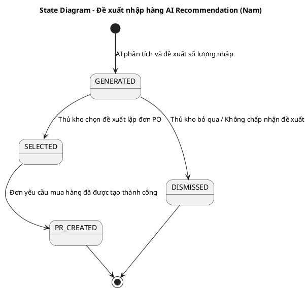

#### D. Communication Diagram: Luồng xử lý phân tích AI Forecast
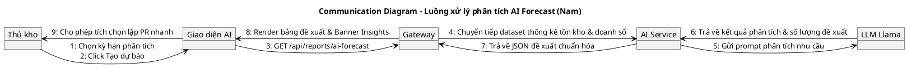

---

## 💻 HƯỚNG DẪN CÁCH KẾT XUẤT ẢNH TỪ FILE HƯỚNG DẪN PLANTUML

Các thành viên có thể xuất mã nguồn trên thành hình ảnh sơ đồ `.png` hoặc `.svg` chất lượng cao phục vụ làm Slide hoặc chèn vào file Word báo cáo bằng 2 phương pháp:

### Phương pháp 1: Kết xuất nhanh thông qua Web (PlantText)
1.  Truy cập vào trang web kết xuất: [https://www.planttext.com](https://www.planttext.com)
2.  Sao chép toàn bộ mã nguồn của sơ đồ mình phụ trách (từ dòng `@startuml` cho đến hết dòng `@enduml`).
3.  Dán đoạn mã đã copy vào khung soạn thảo văn bản bên trái.
4.  Nhấp vào nút **Generate** (hoặc phím tắt Ctrl + Enter). Sơ đồ sẽ hiển thị trực quan ở khung bên phải.
5.  Click chuột phải vào ảnh chọn **Save Image As...** để tải file ảnh về máy tính.

### Phương pháp 2: Kết xuất trực tiếp trên VS Code
1.  Mở phần mềm VS Code, truy cập mục Extensions (Ctrl+Shift+X), cài đặt Extension có tên: **PlantUML** (tác giả *jebbs*).
2.  Tải và cài đặt phần mềm phụ thuộc **Graphviz** trên máy tính nếu chưa có (Tải tại: [https://graphviz.org/download/](https://graphviz.org/download/)).
3.  Tạo một file trắng trong VS Code với phần mở rộng là `.puml` (ví dụ: `du-bao-ai.puml`).
4.  Dán mã nguồn PlantUML vào file này.
5.  Nhấn tổ hợp phím `Alt + D` để hiển thị cửa sổ xem trước (Preview) trực tiếp sơ đồ.
6.  Nhấn phím `F1` hoặc nhấn tổ hợp `Ctrl + Shift + P` -> gõ chọn: `PlantUML: Export Current Diagram` để lưu ảnh chất lượng cao vào thư mục dự án của mình.
